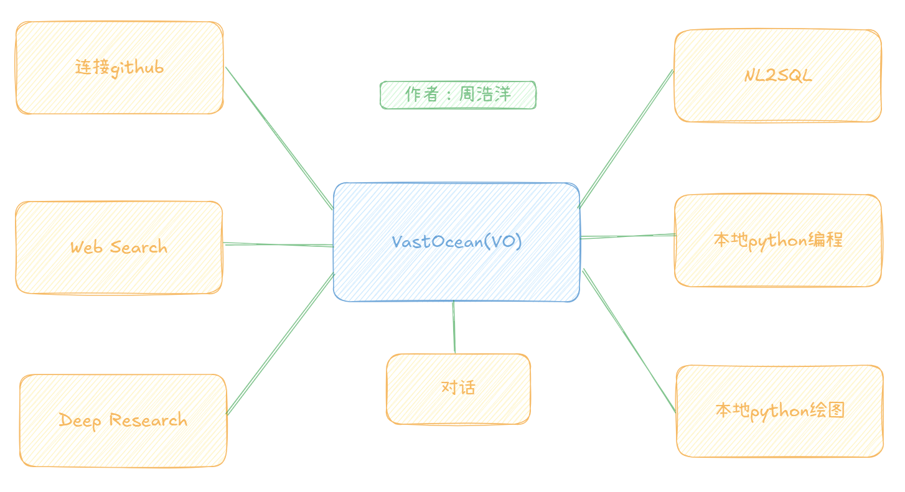
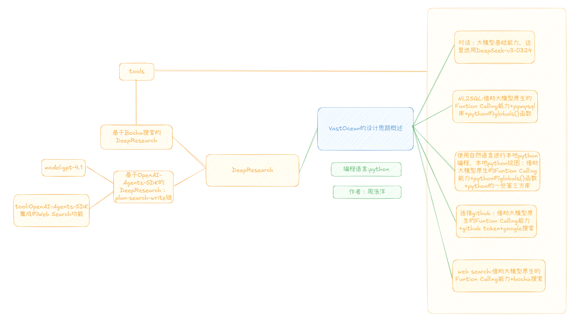

# 重要声明：

这里是Zane(周浩洋)的《人工智能引论》的大报告项目地址，于2025年5月29日完结。

任何人不经我的同意，不得商用。

使用者不能声称自己是原创，使用时要引用该项目地址。以上传时间为证，该项目的原创者是Zane。

----

# 关于VastOcean:



**VastOcean(简称VO)**是一款通用AI Agent软件程序。

它可以实现：

1.用户可以和VO对话交流聊天。

2.用户可以用自然语言和本地mysql数据库交互**（NL2SQL,Natural Language to SQL)。**

3.用户可以用自然语言实现**本地python编程。**

4.用户可以用自然语言实现**python绘图**。

5.用户可以用自然语言和**github交互**。

6.用户可以用自然语言请教VO，如果VO内部知识没有答案，会自动调用**web搜索**功能获取最新消息，然后总结回复用户。

7.用户可以用VO提供的**Deep Research**功能，实现某知识的深度研究，成为用户科研和学习路上的好帮手。

---

**VO的详细实现思路：**



我们的设计思路为：

**1.对话功能：**大模型本身就具有和用户对话交流功能，我们在messages里保存历史的20条信息（短期记忆）。

**2.NL2SQL功能:**一方面，利用大模型的原生Function Calling能力，我们设计一个sql_inter_tool（负责数据库查询任务）和extract_data_tool（负责提取数据库的某一张表到python的dataframe类型的变量里）；另一方面，使用python语言的pymysql库连接到mysql以及使用python语言的globals()函数监测python本地环境变量。两者结合即可实现NL2SQL。

**3.使用自然语言进行本地python编程和本地python绘图功能：**一方面，利用大模型的原生Function Calling能力，我们设计一个python_inter_tool（负责除了python编程绘图之外的所有python编程任务）和fig_inter_tool（负责python编程绘图任务）；另一方面，使用python语言的常见第三方库（比如numpy,pandas,matplotlib等）以及使用python语言的globals()函数监测python本地环境变量。两者结合即可实现使用自然语言进行本地python编程和本地python绘图。

**4.连接github功能：**先利用google search搜索和用户问题相关的github项目地址，然后利用大模型的原生Function Calling能力，设计一个get_answer_github_tool（利用github token连接到github）。

**5.web search功能：**利用大模型的原生Function Calling能力，设计一个get_answer_tool（利用bocha search api连接到web）。

**6.Deep Research功能：**VO提供了**两种**实现Deep Research功能的方式。

**第一种**是基于bocha搜索的Deep Research实现，利用Prompt构建技巧，用户告诉大模型研究对象后，先构建一个让大模型分析研究对象后追问用户需求的prompt喂给大模型，用户回复需求后，再构建一个大模型根据用户的研究对象和新提供的需求进行研究的prompt喂给大模型，大模型会利用我们之前构建的一系列tools(sql_inter_tool、extract_data_tool、python_inter_tool、fig_inter_tool、get_answer_github_tool、get_answer_tool)来生成研究报告，由于get_answer_tool是根据bocha搜索构建的工具，而深入研究时基本上一定会用到该工具，所以我们称这种方式的实现为基于bocha搜索的Deep Research。

**第二种**是基于OpenAI-Agents-SDK框架，直接使用其内置的web search工具和封装好的Multi Agents开发流程实现的Deep Research，我们利用三个Agent串联工作，分别是planner_agent,search_agent和writer_agent，planner_agent负责提前规划好需要搜索的关键词和搜索的原因推断，search_agent根据planner_agent提供的信息进行web搜索，writer_agent根据search_agent提供的信息总结撰写研究报告。

----

# 关于实验环境：

1. **硬件环境 (Hardware Environment):**

   外部服务全部来自API，对本地硬件环境无要求。

2. **软件环境 (Software Environment):**

   - 操作系统 (OS): windows 11

   - Python 版本: 3.12.4

   - 核心依赖库版本（requirements.txt):

     ```reStructuredText
     # Core AI and Language Model Interaction
     openai==1.67.0
     tiktoken==0.9.0
     
     # OpenAI Agents SDK
     openai-agents==0.0.5 
     
     # Data Validation and Structures
     pydantic==2.11.4
     
     # Data Handling and Numerics
     numpy==2.2.4
     pandas==2.2.3
     
     # Database Interaction
     pymysql==1.1.1
     
     # HTTP Requests
     requests==2.32.3
     
     # Environment Variable Management
     python-dotenv==1.0.1
     
     # Asynchronous Operations
     nest-asyncio==1.6.0
     
     # Plotting and Visualization
     matplotlib==3.10.1
     seaborn==0.13.2
     ```

   - MySQL数据库版本:  MySQL 8.0.40

3. **API密钥与凭证配置:**

   - **.env文件（请你自己手动添加）**

     ```reStructuredText
     OPENAI_API_KEY=
     OPENAI_BASE_URL= https://api.openai.com/v1
     BASE_URL= https://api.deepseek.com
     MODEL= deepseek-chat
     API_KEY=
     GITHUB_TOKEN=
     GOOGLE_SEARCH_API_KEY=
     CSE_ID=
     HOST=localhost
     USER=root
     MYSQL_PW=
     DB_NAME=
     PORT=3306
     search_user_agent=Mozilla/5.0 (Windows NT 10.0; Win64; x64) AppleWebKit/537.36 (KHTML, like Gecko) Chrome/134.0.0.0 Safari/537.36
     BOCHA_WEB_SEARCH_API=
     ```

     需要的配置：

     `OPENAI_API_KEY`:OpenAI官网上获取API KEY。

     `API_KEY`:DeepSeek官网上获取API KEY。

     `GITHUB_TOKEN`:Github官网上获取github个人访问令牌。

     `GOOGLE_SEARCH_API_KEY`:google官网上获取google custom search api。

     `CSE_ID`:Google custom search api的search engine ID。

     `MYSQL_PW`:mysql数据库密码

     `DB_NAME`:mysql数据库名字

     `PORT`:数据库使用的端口号

     `BOCHA_WEB_SEARCH_API`:博查web搜索API。

   - 代理设置: 

     ```python
     os.environ['HTTP_PROXY'] = 'http://127.0.0.1:7890'
     os.environ['HTTPS_PROXY'] = 'http://127.0.0.1:7890
     ```

----

# **更多具体信息：**

请看该项目的报告：VastOcean.pdf