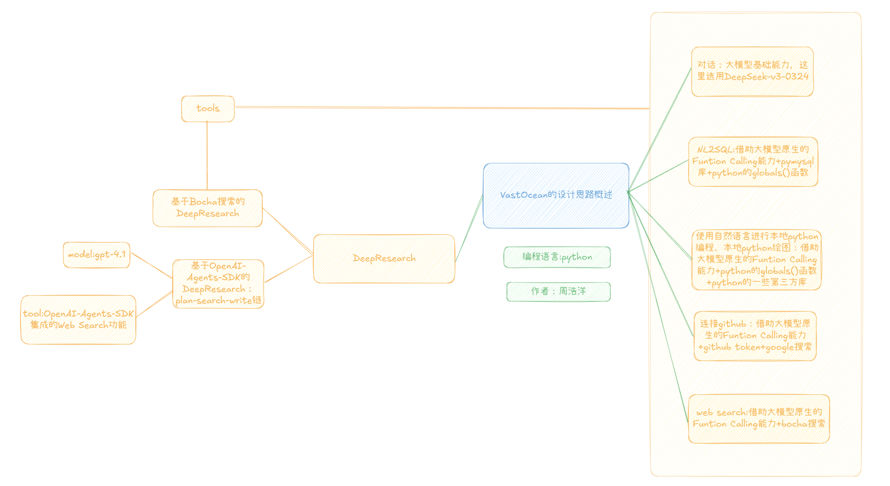
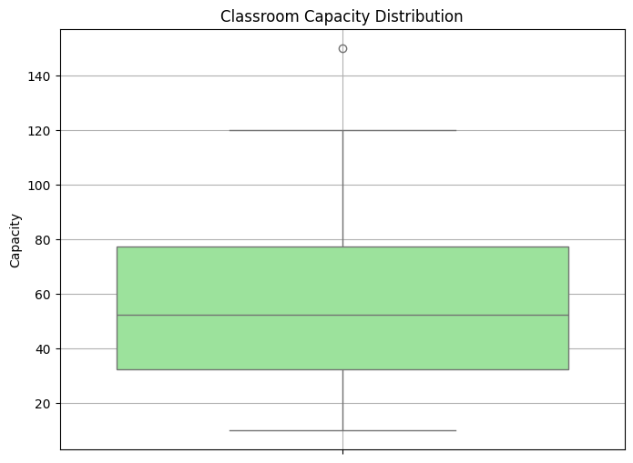

# 基于大模型原生Function-calling能力和OpenAI-Agents-SDK框架构建的通用AI Agent系统：🌊VastOcean(VO)

## 1.通用人工智能代理（General AI Agent）背景介绍

### 1.1 大模型浪潮的掀起

​       2022年11月30日，OpenAI发布gpt-3.5系列模型。其强大的自然语言理解和生成能力，能够进行流畅的多轮对话、撰写文章、创作诗歌、编写代码，甚至回答复杂问题，迅速吸引了全球用户的广泛关注和使用。在短短几天内，用户数量就突破百万，引发了媒体的争相报道和社交媒体的病毒式传播，从而在全球范围内掀起了一股AI热潮。

​	   在这波AI热潮中，大模型不断更新迭代，截止2025年5月28日，水平最高的大语言模型有：国外Google的Gemini-2.5-pro（主打一个大模型拥有超强多模态能力等），Anthropic的Claude opus 4（主打编程能力等），OpenAI的o3、o4系列模型（主打推理能力、引入“图像思维”、实现全工具集成以及多模态处理等综合能力等），国内DeepSeek公司的DeepSeek R1（主打开源、推理能力、编程能力和性价比等）和DeepSeek V3-0324模型（主打开源、性价比等）以及阿里巴巴的Qwen3系列模型（主打开源、提供不同参数规模的选择，下到0.6B上到235B以及混合思考推理能力）。


### 1.2 大模型能力的迭代提升促使应用端发展，2025年是Agent爆发之年

​	   大模型基础能力的提升，促进了AI Agent开发工作量的持续减少。之前开发AI Agent,受限于大模型基础能力，提示词会设计得十分复杂，冗余信息很多，需要各种工程技巧来弥补大模型基础能力的不足。现在大模型基础能力的提升，让AI Agent，尤其是**通用AI Agent**的开发门槛大幅降低。**通用人工智能代理（General AI Agent）**，通常也指追求**通用人工智能（Artificial General Intelligence, AGI）**的智能体，是人工智能领域一个宏大且具有挑战性的目标。与目前我们广泛应用的专注于特定任务的“狭义人工智能”（Narrow AI）不同，通用AI代理旨在构建能够像人类一样理解、学习，并在各种复杂环境中自主完成多种任务的智能系统。

​	  2025年，是AI届的Agent年。国内外各大专家，youtube、B站上的所有AI博主，一致认为2025年是属于Agent的一年。有人把大模型这波浪潮分成了上下半场，上半场是大模型的开发训练，下半场是大模型的应用，越来越多的人认为大模型发展进入了下半场。而下半场的核心，就是AI Agent。


[【万字揭秘】2025年最大风口：Agent 智能体到底是什么？_哔哩哔哩_bilibili](https://www.bilibili.com/video/BV17fX5Y5Ecv/?spm_id_from=333.337.search-card.all.click)


[我对2025年AI的判断_哔哩哔哩_bilibili](https://www.bilibili.com/video/BV1B96oYeEwx/?spm_id_from=333.337.search-card.all.click)

​	 站在时代的风口，通用AI Agent也不断推陈出新。今年爆火的Manus和质谱AI的AutoGLM沉思，都是非常棒的通用AI Agent产品。


[Manus官网 - 通用型AI Agent官方网站入口 (ruanmao.net)](https://manus.ruanmao.net/)、


[AutoGLM (xiao9905.github.io)](https://xiao9905.github.io/AutoGLM/?utm_source=ai-bot.cn)

​	 综上所述，现在，当下，就是构建通用AI Agent的最好时机！

## 2.VastOcean系统的任务目标和功能

### 2.1 VastOcean名字的由来

​	  笔者的名是：浩洋，因此由我设计的通用AI Agent命名为VastOcean。后面为了方便，我们把VastOcean简称为VO。

### 2.2 VastOcean的任务目标和功能

​	  VastOcean是一款通用AI Agent软件，旨在实现：

​	1.用户可以和VO对话交流聊天
​    2.用户可以用自然语言和本地mysql数据库交互**（NL2SQL,Natural Language to SQL)**
​	3.用户可以用自然语言实现**本地python编程**
​    4.用户可以用自然语言实现**python绘图**
​    5.用户可以用自然语言和**github交互**
​	6.用户可以用自然语言请教VO，如果VO内部知识没有答案，会自动调用**web搜索**功能获取最新消息，然后总结回复用户。
​    7.用户可以用VO提供的**Deep Research**功能，实现某知识的深度研究，成为用户科研和学习路上的好帮手。

​	VO实现了对话、编程、编程绘图、web搜索、Deep Research、NL2SQL和连接github等多种功能，目标就是成为一个通用的AI Agent系统。


## 3.VastOcean系统的设计思路概述

### 3.1 VastOcean系统设计思路架构图




### 3.2 VastOcean系统设计思路架构图解释

如图所示，我们的设计思路为：
**1.对话功能：**大模型本身就具有和用户对话交流功能，我们在messages里保存历史的20条信息（短期记忆）。
**2.NL2SQL功能:**一方面，利用大模型的原生Function Calling能力，我们设计一个sql_inter_tool（负责数据库查询任务）和extract_data_tool（负责提取数据库的某一张表到python的dataframe类型的变量里）；另一方面，使用python语言的pymysql库连接到mysql以及使用python语言的globals()函数监测python本地环境变量。两者结合即可实现NL2SQL。
**3.使用自然语言进行本地python编程和本地python绘图功能：**一方面，利用大模型的原生Function Calling能力，我们设计一个python_inter_tool（负责除了python编程绘图之外的所有python编程任务）和fig_inter_tool（负责python编程绘图任务）；另一方面，使用python语言的常见第三方库（比如numpy,pandas,matplotlib等）以及使用python语言的globals()函数监测python本地环境变量。两者结合即可实现使用自然语言进行本地python编程和本地python绘图。
**4.连接github功能：**先利用google search搜索和用户问题相关的github项目地址，然后利用大模型的原生Function Calling能力，设计一个get_answer_github_tool（利用github token连接到github）。
**5.web search功能：**利用大模型的原生Function Calling能力，设计一个get_answer_tool（利用bocha search api连接到web）。
**6.Deep Research功能：**VO提供了**两种**实现Deep Research功能的方式。**第一种**是基于bocha搜索的Deep Research实现，利用Prompt构建技巧，用户告诉大模型研究对象后，先构建一个让大模型分析研究对象后追问用户需求的prompt喂给大模型，用户回复需求后，再构建一个大模型根据用户的研究对象和新提供的需求进行研究的prompt喂给大模型，大模型会利用我们之前构建的一系列tools(sql_inter_tool、extract_data_tool、python_inter_tool、fig_inter_tool、get_answer_github_tool、get_answer_tool)来生成研究报告，由于get_answer_tool是根据bocha搜索构建的工具，而深入研究时基本上一定会用到该工具，所以我们称这种方式的实现为基于bocha搜索的Deep Research。**第二种**是基于OpenAI-Agents-SDK框架，直接使用其内置的web search工具和封装好的Multi Agents开发流程实现的Deep Research，我们利用三个Agent串联工作，分别是planner_agent,search_agent和writer_agent，planner_agent负责提前规划好需要搜索的关键词和搜索的原因推断，search_agent根据planner_agent提供的信息进行web搜索，writer_agent根据search_agent提供的信息总结撰写研究报告。

## 4.VastOcean系统的详细实现方法

`VastOcean` (VO) 系统的核心是一个名为 `VastOcean` 的 Python 类，它封装了与大模型交互、工具调用、任务处理和用户交互的全部逻辑。下面将详细阐述其实现方法。

### 4.1 完整代码VastOcean.py

完整代码见附录，或者github地址：

### 4.2 初始化与配置 (`__init__`)

系统启动时，`VastOcean` 类的构造函数 `__init__` 会执行一系列初始化操作：

1.  **环境依赖与库导入**：
    首先导入必要的Python库，包括 `os` (操作系统交互), `openai` (与OpenAI及兼容API交互), `glob`, `shutil`, `tiktoken` (计算token数), `pydantic` (数据校验与模型定义), `rich.markdown` (富文本输出), `time`, `numpy`, `pandas` (数据处理), `pymysql` (MySQL数据库连接), `dotenv` (加载环境变量), `IPython.display` (Jupyter环境下的展示), `nest_asyncio` (支持异步嵌套), `asyncio`, `json`, `io`, `inspect`, `requests` (HTTP请求), `re` (正则表达式), `base64`, `BeautifulSoup` 和 `lxml` (HTML/XML解析), `matplotlib` 和 `seaborn` (绘图)。特别地，导入 `agents` 相关的类（如 `Agent`, `WebSearchTool`, `ModelSettings`, `OpenAIResponsesModel`, `OpenAIChatCompletionsModel`, `Runner`, `set_default_openai_client`, `set_tracing_disabled`, `function_tool`），这些是 `OpenAI-Agents-SDK` 框架的核心组件。
    
2.  **常量与环境变量加载**：
    *   `MAX_TOKENS_LIMIT`：设定了从外部工具（如网页搜索）获取内容时的token上限，防止超出模型处理能力。
    *   通过 `load_dotenv(override=True)` 加载 `.env` 文件中定义的环境变量。这些变量包括：
        *   **主模型API配置**：`API_KEY`, `MODEL` (如 `gpt-4.1`, `deepseek-chat` 等), `BASE_URL` (自定义模型服务地址)。
        *   **GitHub配置**：`GITHUB_TOKEN` (用于访问GitHub API)。
        *   **博查搜索API**：`BOCHA_WEB_SEARCH_API`。
        *   **谷歌搜索API**：`GOOGLE_SEARCH_API_KEY`, `CSE_ID` (自定义搜索引擎ID)。
        *   **搜索辅助参数**：`search_user_agent`。
        *   **MySQL数据库配置**：`HOST`, `USER`, `MYSQL_PW`, `DB_NAME`, `PORT`。
        *   **OpenAI SDK专用API配置**：`OPENAI_API_KEY`, `OPENAI_BASE_URL` (若使用OpenAI官方模型或兼容的SDK服务)。
    *   **HTTP代理设置**：`os.environ['HTTP_PROXY']` 和 `os.environ['HTTPS_PROXY']` 设置为 `http://127.0.0.1:7890`，所有外部HTTP/HTTPS请求将通过本地代理。
3.  **工具 (Function Calling Tools) 定义**：
    VO系统为大模型定义了一系列可调用的外部工具，这些工具的描述和参数结构遵循OpenAI Function Calling规范。
    *   `python_inter_tool`: 用于执行非绘图类的Python代码。描述中强调了参数必须是JSON格式字符串，并提供了示例。
    *   `fig_inter_tool`: 专用于执行Python绘图代码。描述详细说明了代码要求（如包含import、数据定义、返回`fname`图像对象）和参数。
    *   `sql_inter_tool`: 用于执行SQL查询（非数据提取）。强调使用`pymysql`连接MySQL，并区分于`extract_data`。
    *   `extract_data_tool`: 用于将MySQL数据库中的表提取到Python环境的Pandas DataFrame中。
    *   `get_answer_tool`: 通用联网搜索工具，当模型知识库不足时调用，利用博查搜索API。明确指出GitHub相关问题应使用`get_answer_github_tool`。
    *   `get_answer_github_tool`: 专用于从GitHub搜索项目信息和README。
4.  **提示词风格定义 (Prompts for Deep Research - Bocha Version)**：
    *   `prompt_style1`: 用于“基于bocha搜索的Deep Research”的第一阶段。指导模型在用户提出宽泛问题后，进行友好且引导性的追问，以明确用户真实需求。提供了示例对话。
    *   `prompt_style2`: 用于“基于bocha搜索的Deep Research”的第二阶段。在用户明确需求后，指导模型作为资深研究员，利用所有可用外部工具进行广泛深入的信息收集，并生成详细报告。提供了示例流程，并要求回答字数。
5.  **消息历史初始化**：
    `self.messages` 用于存储对话历史。如果初始化时未传入`messages`参数，则会默认包含一条系统消息："你是VastOcean，一名助手。"
6.  **API客户端初始化**：
    *   `self.client`: 主要的OpenAI兼容API客户端，使用 `self.API_KEY` 和 `self.BASE_URL` 初始化，用于常规对话和基于Function Calling的工具调用。
    *   `self.openai_sdk_client`: OpenAI官方SDK格式的同步客户端，使用 `self.OPENAI_API_KEY` 和 `self.OPENAI_BASE_URL`。
    *   `self.openai_client`: OpenAI官方SDK格式的异步客户端 (`AsyncOpenAI`)，用于`OpenAI-Agents-SDK`框架。
    *   `set_default_openai_client(self.openai_client)` 和 `set_tracing_disabled(True)`: 配置`OpenAI-Agents-SDK`的默认客户端并禁用追踪。
7.  **OpenAI-Agents-SDK Agent初始化 (For Deep Research - OpenAI Version)**：
    定义了三个协同工作的Agent：
    *   `planner_agent`: 负责根据用户查询制定详细的网页搜索计划。其指令(`PLAN_PROMPT`)要求输出10-20个搜索词，模型为`gpt-4.1`，输出类型为`WebSearchPlan` (Pydantic模型)。
    *   `search_agent`: 负责执行单个搜索词的网页搜索并生成简洁摘要。其指令(`SEARCH_INSTRUCTIONS`)要求摘要简短精炼，工具为`WebSearchTool` (SDK内置)，模型为`gpt-4.1`，并强制使用工具。
    *   `writer_agent`: 负责整合搜索摘要，撰写最终的详细研究报告。其指令(`REPORT_PROMPT_2`)要求生成中文的、详细的Markdown格式报告（10-20页，至少1500字），模型为`gpt-4.1`，输出类型为`ReportData` (Pydantic模型，包含摘要、报告和后续问题)。
8.  **初始化测试**：
    尝试调用 `self.client.models.list()` 来验证主模型API是否可达，并打印相应的成功或失败信息。

### 4.3 工具实现方法

VO系统实现了其定义的每个工具对应的Python方法：

1.  **`python_inter(self, py_code: str, g='globals()') -> str`**:
    *   接收Python代码字符串 `py_code`。
    *   尝试使用 `eval()` 执行代码（如果代码是单个表达式）。
    *   如果 `eval()` 失败，则使用 `exec()` 执行。
    *   它会比较执行前后全局变量的变化，如果产生新变量，则返回新变量及其值的字符串表示；否则返回"已经顺利执行代码"或错误信息。
    *   `g` 参数默认为 `globals()`，作为代码执行的命名空间。
2.  **`fig_inter(self, py_code, fname, g='globals()')`**:
    *   接收Python绘图代码 `py_code` 和期望的图像对象变量名 `fname`。
    *   导入 `matplotlib.pyplot`, `seaborn`, `pandas`。
    *   在 `pics` 目录下创建子目录（如果不存在）。
    *   执行 `py_code`，并将 `plt`, `pd`, `sns` 注入到局部执行环境。
    *   尝试从局部变量或 `plt.gcf()` 获取名为 `fname` 的图像对象。
    *   如果找到有效的图像对象，则将其保存到 `pics` 目录下的PNG文件，并关闭图像以释放内存。
    *   返回成功保存的路径或相应的错误/警告信息。
3.  **`sql_inter(self, sql_query, g='globals()')`**:
    *   接收SQL查询语句 `sql_query`。
    *   使用 `pymysql` 和预设的数据库凭证连接到MySQL数据库。
    *   执行SQL查询。
    *   获取查询结果 (`cursor.fetchall()`) 并将其转换为JSON字符串返回。
    *   确保数据库连接在使用后关闭。
4.  **`extract_data(self, sql_query, df_name, g='globals()')`**:
    *   接收SQL查询语句 `sql_query` 和期望的DataFrame变量名 `df_name`。
    *   连接到MySQL数据库。
    *   使用 `pd.read_sql(sql_query, connection)` 执行查询并将结果直接读入一个Pandas DataFrame。
    *   将此DataFrame赋值给全局环境中的 `g[df_name]`。
    *   返回成功信息或错误信息，并关闭数据库连接。
5.  **`get_answer(self, q, g='globals()')` (基于博查搜索)**:
    *   此方法实际上调用了 `self.get_search_result(q)`。
    *   **`get_search_result(self, q)`**:
        *   调用 `self.bocha_search(query=q, num_results=10, include_images=True)` 来获取搜索结果。
        *   **`bocha_search(self, query, num_results=5, include_images=True)`**:
            *   向博查API (`https://api.bochaai.com/v1/web-search`) 发送POST请求，包含查询 `query`、数量 `num_results` 等参数。
            *   使用 `self.bocha_web_search_api` 作为认证令牌。
            *   调用 `self.process_bocha_results()` 处理API响应。
            *   **`process_bocha_results(self, search_results, include_images=True)`**: 解析博查API返回的JSON，提取网页结果（标题、链接、摘要、总结）和图片结果（缩略图URL、内容URL等）。
            *   `bocha_search` 会打印搜索到的网页和图片摘要。
        *   `get_search_result` 遍历网页结果，对每个结果调用 `self.save_single_bocha_result()`。
        *   **`save_single_bocha_result(self, result_item, query, base_dir='./auto_search')`**: 将单个网页搜索结果（标题、链接、内容、token数）保存为JSON文件，文件名基于清理后的标题，存储在 `base_dir/query_cleaned/` 目录下。使用 `self.windows_compatible_name()` 清理文件名和目录名，使用 `self.calculate_tokens()` 计算内容token数。
        *   如果图片结果存在，调用 `self.download_search_images()`。
        *   **`download_search_images(self, query, image_results, base_dir='./search_images', max_images=15)`**: 下载搜索到的图片并保存到 `base_dir/query_cleaned/` 目录。
        *   最后，`get_search_result` 会聚合来自 `web_results` 的内容（优先使用`summary`，其次是`snippet`），直到达到 `self.MAX_TOKENS_LIMIT`，并返回聚合后的文本。
6.   **`google_search(self, query, num_results=10, site_url=None)`**:
    * **目的**: 此函数通过调用 Google Custom Search API 来执行网页搜索。它可以进行通用搜索，或者通过 `site_url` 参数将搜索范围限定在特定网站内。
      * **参数**:
                    *   `query` (str): 用户的搜索查询词。
                    *   `num_results` (int, optional): 希望返回的搜索结果数量，默认为10。
                    *   `site_url` (str, optional): 如果提供此参数，搜索将被限制在该网站域名内（例如，`"github.com"`）。默认为 `None`，表示进行全网搜索。
            *   **实现逻辑**:
                1.  **API端点**: 定义Google Custom Search API的URL：`url = "https://www.googleapis.com/customsearch/v1"`。
                2.  **构建请求参数**:
                    *   基础参数包括：`q` (查询词), `key` (来自 `self.google_search_key`), `cx` (来自 `self.cse_id`，自定义搜索引擎ID), `num` (结果数量)。
                    *   如果 `site_url` 被提供，则额外添加 `siteSearch: site_url` 到参数中，以实现站内搜索。
                3.  **发送HTTP GET请求**: 使用 `requests.get(url, params=params)` 发送API请求。
                4.  **错误处理**: `response.raise_for_status()` 会检查HTTP响应状态码，如果发生错误（如4xx或5xx），则会抛出异常。
                5.  **解析JSON响应**: `search_results = response.json().get('items', [])` 解析返回的JSON数据，并提取 `items` 字段，如果不存在则返回空列表。
                6.  **提取信息**: 遍历 `search_results` 中的每一个 `item`，提取其 `title` (标题), `link` (链接) 和 `snippet` (摘要)，并将这些信息组织成一个字典列表返回。
       * **在VastOcean中的主要用途**: 被 `get_answer_github` 方法调用，以在 `github.com` 站内搜索信息。
7.  **`get_answer_github(self, q, g='globals()')` (基于谷歌搜索GitHub)**:
    *   调用 `self.google_search(query=q, num_results=5, site_url='https://github.com/')` 在GitHub站内进行谷歌搜索。
    *   **`google_search(self, query, num_results=10, site_url=None)`**: 使用Google Custom Search API (`https://www.googleapis.com/customsearch/v1`)，传入 `self.google_search_key` 和 `self.cse_id` 进行搜索，返回结果列表（标题、链接、摘要）。
    *   使用 `self.extract_github_repos()` 从搜索结果链接中提取GitHub仓库的owner和repo名。
    *   **`extract_github_repos(self, search_results)`**: 解析链接，筛选出形如 `github.com/owner/repo` 的链接。
    *   为每个提取到的仓库信息调用 `self.get_search_text_github(q, dic)`。
    *   **`get_search_text_github(self, q, dic)`**:
        *   调用 `self.get_github_readme(dic)` 获取仓库的README内容。
        *   **`get_github_readme(self, dic)`**: 使用GitHub API (`https://api.github.com/repos/{owner}/{repo}/readme`) 和 `self.github_token` 获取README的Base64编码内容，并解码为UTF-8字符串。
        *   将README内容、清理后的标题（owner_repo）和token数保存为JSON文件，存储在 `./auto_search/{q}/` 目录下。
    *   聚合所有获取到的README内容，直到达到 `self.MAX_TOKENS_LIMIT`，并返回聚合后的文本。

### 4.4 核心对话与任务处理逻辑

1.  **`chat_base(self, messages, client, model)`**:
    *   这是与大模型进行单轮或多轮交互的核心函数。
    *   接收当前消息列表 `messages`、API客户端 `client` 和模型名称 `model`。
    *   会检查最后一条用户消息是否包含数据库相关关键词，并打印调试信息。
    *   调用 `client.chat.completions.create()` 发送请求给大模型，同时传递 `self.tools` 使模型能进行Function Calling。
    *   **工具调用处理**：
        *   如果模型的响应 `finish_reason` 是 `tool_calls`，表示模型请求调用一个或多个工具。
        *   进入一个循环：
            *   调用 `self.create_function_response_messages(messages, response)`。
            *   **`create_function_response_messages(self, messages, response)`**:
                *   将模型的工具调用请求消息追加到 `messages` 列表。
                *   遍历每个 `tool_call`：
                    *   获取工具名称 (`tool_name`) 和参数 (`tool_args`)。
                    *   从 `available_functions` 字典中查找对应的Python方法。
                    *   调用 `self.print_code_if_exists()` 打印即将执行的代码（如果是SQL或Python）。
                    *   执行工具方法（如 `self.python_inter(**tool_args)`），并将 `globals()` 作为 `g` 参数传入。
                    *   将工具的执行结果（作为一条role为`tool`的消息）追加到 `messages` 列表。
            *   用更新后的 `messages` 再次调用大模型。
            *   此循环持续直到模型的 `finish_reason`不再是 `tool_calls`。
    *   返回模型最终的非工具调用响应。
    *   包含错误处理，如果模型调用失败，会打印错误并返回 `None`。

2.  **`chat(self)`**:
    *   提供一个命令行交互界面。
    *   在一个无限循环中接收用户输入。
    *   将用户问题追加到 `self.messages` (并截断历史记录，只保留最近20条)。
    *   调用 `self.chat_base()` 获取模型响应。
    *   打印模型的回复，并将回复追加到 `self.messages`。
    *   用户输入"退出"时结束对话。

3.  **`research_task_simple(self, question)` (基于博查的深度研究)**:
    *   **第一阶段 - 需求澄清**:
        *   将用户初始问题 `question` 格式化进 `self.prompt_style1`。
        *   调用大模型获取引导性追问。
        *   打印模型的追问，并等待用户输入补充说明。
    *   **第二阶段 - 执行研究与报告生成**:
        *   将用户的补充说明格式化进 `self.prompt_style2` (该prompt也包含了原始问题)。
        *   将包含原始问题、模型追问、用户补充说明以及`prompt_style2`的消息列表传递给 `self.chat_base()`。`chat_base`内部会根据`prompt_style2`的指导，协调大模型调用其定义的各种工具（如`get_answer`进行网页搜索，`python_inter`进行数据分析等）来收集信息。
        *   打印大模型生成的最终研究报告。
        *   调用 `self.save_markdown_to_file()` 将报告保存为Markdown文件，文件名基于初始问题。

4.  **`research_task_deep(self, query: str)` (基于OpenAI-Agents-SDK的深度研究)**:
    这是一个异步方法，利用 `OpenAI-Agents-SDK` 实现多Agent协作的深度研究。
    *   **`plan_searches(self, query: str) -> WebSearchPlan`**:
        *   调用 `Runner.run(self.planner_agent, f"Query: {query}")`。
        *   `planner_agent` 根据 `PLAN_PROMPT` 生成搜索计划。
        *   返回 `WebSearchPlan` 对象。
    *   **`perform_searches(self, search_plan: WebSearchPlan) -> list[str]`**:
        *   为搜索计划中的每个 `WebSearchItem` 创建一个异步任务，调用 `self.search(item)`。
        *   使用 `asyncio.as_completed()` 并发执行这些搜索任务。
        *   收集所有搜索摘要结果。
    *   **`search(self, item: WebSearchItem) -> str | None`**:
        *   调用 `Runner.run(self.search_agent, input=f"Search term: {item.query}\nReason for searching: {item.reason}")`。
        *   `search_agent` 使用 `WebSearchTool` 执行实际的网页搜索并根据 `SEARCH_INSTRUCTIONS` 生成摘要。
        *   返回搜索摘要字符串。
    *   **`write_report(self, query: str, search_results: list[str]) -> ReportData`**:
        *   调用 `Runner.run(self.writer_agent, input=f"Original query: {query}\nSummarized search results: {search_results}")`。
        *   `writer_agent` 根据 `REPORT_PROMPT_2` 和提供的搜索摘要，撰写详细报告。
        *   在报告生成过程中，会模拟打印一些进度信息。
        *   返回 `ReportData` 对象。
    *   `research_task_deep` 主流程：依次调用 `plan_searches`, `perform_searches`, `write_report`，然后打印报告内容和后续问题，并使用 `self.save_report_as_md()` 保存报告。

### 4.5 辅助与工具函数

*   **`print_code_if_exists(self, function_args)`**: 检查函数参数中是否包含 `sql_query` 或 `py_code`，如果存在，则将其格式化为Markdown代码块并打印。
*   **`calculate_tokens(self, text)`**: 使用 `tiktoken` 库为 "gpt-3.5-turbo" 模型计算给定文本的token数量。
*   **`windows_compatible_name(self, s, max_length=255)`**: 将字符串转换为Windows兼容的文件/文件夹名（替换非法字符、去首尾空格点、处理保留字、截断长度）。
*   **`save_markdown_to_file(self, content: str, filename_hint: str, directory="research_task")`**: 将内容保存到指定目录下的Markdown文件。
*   **`save_report_as_md(self, query: str, markdown_content: str)`**: 专用于保存 `research_task_deep` 生成的报告，文件名基于用户查询，保存在 `research_reports` 文件夹。
*   **`clear_messages(self)`**: 清空 `self.messages` 对话历史。

### 4.6 主程序入口 (`main`)

*   `main()` 函数提供了一个简单的命令行菜单，允许用户选择：
    1.  "chat with tools" (调用 `vastOcean.chat()`)
    2.  "deep research(bocha version)" (调用 `vastOcean.research_task_simple()`)
    3.  "deep research(openai version)" (调用 `asyncio.run(vastOcean.research_task_deep())`)
    4.  "exit" (退出程序)
*   每次选择后，会重新实例化 `VastOcean` 对象（历史消息和状态不会在不同任务类型间保留）。

VO系统通过精心设计的工具、提示词以及OpenAI原生Function Calling和OpenAI-Agents-SDK框架的结合，实现了对话、本地编程与绘图、数据库交互、网页搜索和两种模式的深度研究功能，成为一个通用的AI Agent。

## 5.VastOcean系统的实验验证(Experimental Validation of the System)

本章节详细介绍了为验证VastOcean系统各项功能而设计的实验方案、所使用的数据集以及对实验结果的总结与分析。

### 5.1 实验设置 (Experimental Setup)

1.  **硬件环境 (Hardware Environment):**
  
    外部服务全部来自API，对本地硬件环境无要求。
    
2.  **软件环境 (Software Environment):**
  
    * 操作系统 (OS): windows 11
    
    * Python 版本: 3.12.4
    
    * 核心依赖库版本（requirements.txt):
    
        ```reStructuredText
        # Core AI and Language Model Interaction
        openai==1.67.0
        tiktoken==0.9.0
        
        # OpenAI Agents SDK
        openai-agents==0.0.5 
        
        # Data Validation and Structures
        pydantic==2.11.4
        
    	# Data Handling and Numerics
        numpy==2.2.4
        pandas==2.2.3
        
        # Database Interaction
        pymysql==1.1.1
        
        # HTTP Requests
        requests==2.32.3
        
        # Environment Variable Management
        python-dotenv==1.0.1
        
        # Asynchronous Operations
        nest-asyncio==1.6.0
        
        # Plotting and Visualization
        matplotlib==3.10.1
        seaborn==0.13.2
        ```
    
    * MySQL数据库版本:  MySQL 8.0.40
    
3.  **API密钥与凭证配置:**
  
    * .env文件
    
        ```reStructuredText
        OPENAI_API_KEY=
        OPENAI_BASE_URL= https://api.openai.com/v1
        BASE_URL= https://api.deepseek.com
        MODEL= deepseek-chat
        API_KEY=
        GITHUB_TOKEN=
        GOOGLE_SEARCH_API_KEY=
        CSE_ID=
        HOST=localhost
        USER=root
        MYSQL_PW=
        DB_NAME=
        PORT=3306
        search_user_agent=Mozilla/5.0 (Windows NT 10.0; Win64; x64) AppleWebKit/537.36 (KHTML, like Gecko) Chrome/134.0.0.0 Safari/537.36
        BOCHA_WEB_SEARCH_API=
        ```
    
        需要的配置：
    
        `OPENAI_API_KEY`:OpenAI官网上获取API KEY。
    
        `API_KEY`:DeepSeek官网上获取API KEY。
    
        `GITHUB_TOKEN`:Github官网上获取github个人访问令牌。
    
        `GOOGLE_SEARCH_API_KEY`:google官网上获取google custom search api。
    
        `CSE_ID`:Google custom search api的search engine ID。
    
        `MYSQL_PW`:mysql数据库密码
    
        `DB_NAME`:mysql数据库名字
    
        `PORT`:数据库使用的端口号
    
        `BOCHA_WEB_SEARCH_API`:博查web搜索API。
    
    * 代理设置: 
    
        ```python
        os.environ['HTTP_PROXY'] = 'http://127.0.0.1:7890'
        os.environ['HTTPS_PROXY'] = 'http://127.0.0.1:7890
        ```
    
4.  **评估指标 (Evaluation Metrics):**
    *   **任务成功率 (Task Success Rate - TSR):** 对于可明确判断成功/失败的任务（如代码执行、SQL查询），成功完成的任务数 / 总任务数。
    *   **准确率 (Accuracy):**
        *   **SQL生成准确率:** 生成的SQL与预期SQL的语义一致性（可人工评估或与黄金标准对比）。
        *   **代码生成准确率:** 生成的Python代码是否能正确完成指定功能。
        *   **信息检索准确率:** Web搜索/GitHub搜索返回的信息与用户问题的相关性和正确性。
    *   **回答质量 (Response Quality - RQ):** (定性评估，可采用Likert量表 1-5)
        *   **流畅性 (Fluency):** 语言是否自然流畅。
        *   **相关性 (Relevance):** 回答是否切中要点。
        *   **完整性 (Completeness):** 信息是否全面。
        *   **正确性 (Correctness):** 信息是否准确无误。
    *   **工具调用正确性 (Tool Invocation Correctness - TIC):** 是否在恰当的时机调用了正确的工具，并且传递了正确的参数。
    *   **报告质量 (Report Quality - for Deep Research):** (定性评估) 深度、广度、结构、洞察力、引用准确性。

### 5.2 数据描述 (Data Description)

1.  **对话测试集:**
  
    *   包含4个多样化的对话提示，涵盖：
        *   简单问答（常识、模型知识库内信息）。
        *   多轮对话跟踪。
        *   指令遵循（例如，写一首诗）。

2.  **NL2SQL测试集:**
  
    *   **数据库 Schema:**
      
        *   这里使用我在数据库课设中建立的表：
          
            
    *   **自然语言查询集:**
      
        *   包含5条自然语言查询，覆盖不同复杂度。VO输出答案将和我的数据库课设正确答案进行对比。
            * 从课程表（course）中查询所有课程信息。
            * 查询选了所有计算机学院开设课程的学生的姓名。
            * 查询课程名以“制作”两字作为中间字的课程信息。（要求“制作”不做开头和结尾）
            * 查询2019年春季开设的，选课人数少于25并且多于15人的课程段信息。
            * 统计计算机学院中所获总学分排名前10位的学生的信息。
    
3.  **Python编程与绘图测试集:**
  
    *   包含5条自然语言编程/绘图任务：
        *   创建一个包含1到10的列表并计算总和。
        *   生成一个包含5个随机数的numpy数组。
        *   计算数据库中所有老师的工资的平均值。
        *   绘制y=x^2在x从-5到5的曲线图。
        *   对数据库进行全方面评估，画出最后数据分析的图表。
    
4.  **GitHub交互测试集:**
  
    *   包含3条自然语言查询：
        *   介绍一下GitHub上的TensorFlow项目
        *   Qwen3的README里主要讲了什么?
    *   GitHub上有什么流行的Python数据可视化库?
    
5.  **Web搜索与Deep Research测试集:**
  
    *   **Web搜索触发问题:** 
        - 拜登是什么时候患的前列腺癌？
        - 2025年NBA季后赛西决和东决分别是哪两支球队？
    *   **Deep Research (Bocha版 - `research_task_simple`) 主题:** 2025年5月最新第一梯队大模型综合对比评估。
    *   **Deep Research (OpenAI Agents SDK版 - `research_task_deep`) 主题:** 2025年5月最新第一梯队大模型综合对比评估。

### 5.3 实验过程与结果分析 (Experimental Procedure and Results Analysis)

对每个功能模块进行单独测试和端到端测试。

1.  **对话交流功能验证:**
  
    *   **过程:** 使用通用对话测试集与VO进行交互，记录对话历史。
    *   **结果与分析:**
    *   
        *   回复的流畅性、相关性、完整性、正确性：非常完美！
        *   多轮对话中上下文理解和保持能力：在回答中，很明显VO再多轮对话中记住了今天的日期，也记住了自己的角色设定，因此非常完美！
    *   指令遵循的准确性：非常完美！
    
2.  **NL2SQL功能验证:**
  
    *   **过程:** 输入NL2SQL测试集中的自然语言查询。
    *   **结果与分析:**
      
        一共5个查询语句，答对了前4道。准确率较高，具体的问答过程请见附录或者开源文档的**`数据库问答.md`**。
    
3.  **本地Python编程与绘图功能验证:**
  
    *   **过程:** 输入Python编程与绘图测试集中的自然语言任务。记录调用的工具 (`python_inter_tool`, `fig_inter_tool`)、生成的Python代码、执行结果（数值或打印信息）以及生成的图像文件。
    *   **结果与分析:**
        *   **TSR:** 100%。
        *   **代码生成准确率:** 100%。
        *   **输出/绘图正确性:**如图所示，画的图准确无误。
        *   
        *   
    *   **TIC:** 工具调用十分准确。
        *   具体的问答过程请见附录或者开源文档的**`python问答.md`**。
    
4.  **GitHub交互功能验证:**
    *   **过程:** 输入GitHub交互测试集中的查询。记录VO的回复，以及后台 `get_answer_github_tool` 的调用情况（包括 `google_search` 的中间结果和最终聚合的README内容）。
    *   **结果与分析:**
        *   **信息检索准确率/相关性:** 返回的GitHub项目信息/README与用户查询高度相关且准确。
        *   **完整性:** README摘要抓住了核心内容。
        *   **TIC:** `get_answer_github_tool` 被正确触发和执行。
        *   具体的问答过程请见附录或者开源文档的**`github项目问答.md`**。

5.  **Web搜索与Deep Research功能验证:**
    *   **Web搜索 (get_answer_tool):**
        *   **过程:** 输入Web搜索触发问题。观察 `get_answer_tool` (Bocha搜索) 是否被调用，记录其搜索并聚合的内容，以及VO最终的回答。
        *   **结果与分析:**
            *   **TIC:** 对于问题1，`get_answer_tool` 在模型知识不足时被正确调用。对于问题2，**没有被调用**。
            *   **搜索内容质量:** 博查搜索返回内容的质量和相关性不稳定，时高时低。
            *   **VO总结质量:** VO对搜索结果的总结准确、简洁、全面。
            *   具体的问答过程请见附录或者开源文档的**`web搜索问答.md`**。
    *   **Deep Research (Bocha版 - `research_task_simple`):**
        *   **过程:** 对每个研究主题，分两步进行：1) 提出初始主题，记录VO的引导性追问；2) 根据追问提供补充信息，记录VO生成的最终研究报告。观察整个过程中工具（尤其是`get_answer_tool`）的调用情况。
        *   **结果与分析 (定性):**
            *   引导性追问的质量和相关性高。
            *   最终报告的深度、广度、结构合理性、信息准确性**非常低**。
            *   工具使用的恰当性**低**。
            *   与`prompt_style1`和`prompt_style2`的符合程度一般。
            *   具体的问答过程和报告结果请见附录或者开源文档的**`Deep Research问答过程_bocha版本.md`**和**`Deep Research问答报告结果_bocha版本.md`**。
    *   **Deep Research (OpenAI Agents SDK版 - `research_task_deep`):**
        *   **过程:** 对每个研究主题，运行 `research_task_deep`。记录Planner Agent生成的搜索计划、Search Agent生成的各搜索摘要、Writer Agent生成的最终报告。
        *   **结果与分析 (定性):**
            *   `PlannerAgent`: 搜索计划的质量、覆盖面高。
            *   `SearchAgent`: 各搜索摘要的准确性和简洁性高。
            *   `WriterAgent`: 最终报告的质量（同上），以及与 `REPORT_PROMPT_2` 的符合程度较高。
        *   多Agent协作的流畅性非常高。
        *   **对比分析:**Bocha版和OpenAI Agents SDK版在相同或相似主题上生成的报告质量相差很大。Bocha版生成的报告质量较低，而OpenAI版生成的报告质量较高，我们把这归功于我们精心设计的串联的Multi Agents流程和OpenAI内置的强大web search功能。
    *   具体的问答过程和报告结果请见附录或者开源文档的**`Deep Research问答过程_openai版本.md`**和**`Deep Research问答报告结果_openai版本.md`**。
    

### 5.4 实验总结与未来展望 (Summary of Experimental Results and Future Work)

#### 5.4.1 总结各项功能的表现 (Summary of Performance of Each Function)

VastOcean (VO)系统在本次实验验证中，整体表现出强大的功能性和较高的任务完成度，但也暴露出一些特定场景下的局限性。

*   **对话交流功能：** 表现出色。VO能够进行流畅、连贯的多轮对话，准确理解用户意图，并遵循角色设定（如记住日期和自身身份）。指令遵循能力强，能够完成如诗歌创作等任务。
*   **NL2SQL功能：** 表现较好。对于中低复杂度的自然语言查询，VO能够准确生成并执行SQL语句，成功率为80%（5个查询中答对4个）。但在处理涉及复杂聚合、多层嵌套或特定排名逻辑的查询时，准确性有所下降，表明其在深度理解复杂数据库逻辑方面仍有提升空间。
*   **本地Python编程与绘图功能：** 表现优异。任务成功率 (TSR) 和代码生成准确率均达到100%。VO能正确调用`python_inter_tool`和`fig_inter_tool`，生成可执行的Python代码，并成功完成数值计算、数据结构创建及图像绘制任务，生成的图像准确无误。工具调用正确性 (TIC) 高。
*   **GitHub交互功能：** 表现良好。能够准确理解用户对GitHub项目的查询意图，通过`get_answer_github_tool`（结合谷歌站内搜索和GitHub API）获取相关的项目信息和README摘要。返回信息的准确性和相关性高，能够抓住核心内容。
*   **Web搜索功能 (get_answer_tool - Bocha版)：** 功能**不稳定**。在模型内部知识不足以回答时，有时能正确触发`get_answer_tool`进行网页搜索。博查搜索返回的内容质量和相关性不稳定。
*   **Deep Research (Bocha版 - `research_task_simple`)：** 表现**不佳**。虽然引导性追问的质量尚可，但最终生成的研究报告在深度、广度、结构和信息准确性方面均有较大欠缺。工具（尤其是`get_answer_tool`）的使用不够恰当和充分，未能有效支撑深度研究的需求，与`prompt_style1`和`prompt_style2`的预期效果有较大差距。
*   **Deep Research (OpenAI Agents SDK版 - `research_task_deep`)：** 表现**优异**。基于OpenAI-Agents-SDK的多Agent协作流程（Planner, Searcher, Writer）效果显著。Planner Agent能制定出高质量的搜索计划，Search Agent能提供准确简洁的摘要，Writer Agent最终生成的报告在深度、广度、结构、信息准确性及与`REPORT_PROMPT_2`的符合程度上均表现出色。多Agent协作流畅，生成的报告质量远高于Bocha版。

**系统优点与强项：**

1.  **多功能集成：** 成功集成了对话、编程、绘图、数据库交互、Web搜索、GitHub交互和深度研究等多种核心AI Agent能力。
2.  **强大的工具调用能力：** 基于大模型原生的Function Calling机制，工具定义清晰，调用逻辑可靠，尤其在Python编程和绘图方面表现突出。
3.  **OpenAI-Agents-SDK的有效应用：** 在`research_task_deep`中，该框架显著提升了复杂任务的处理能力和结果质量，展示了多Agent协作的潜力。
4.  **良好的用户交互体验：** 基础对话流畅自然，命令行界面清晰易用。

**当前存在的不足和待改进之处：**

1.  **Web搜索的稳定性：**对更多时效性问题的响应能力有待加强。
2.  **Deep Research (Bocha版) 的有效性：** 当前基于提示词的简单研究模式效果不理想，未能充分发挥工具潜力，报告质量较低。
3.  **上下文长度限制：** 虽然`self.messages`会截断，但在极长对话或极复杂研究任务中，如何更有效地管理和利用上下文信息仍是一个挑战。

#### 5.4.2 讨论与分析 (Discussion and Analysis)

*   **成功因素分析：**
    *   **大模型基础能力：** 选用如DeepSeek或GPT-4.1等先进大模型是系统各项功能得以实现的基础，其强大的自然语言理解、代码生成和推理能力是关键。
    *   **原生Function Calling：** OpenAI的Function Calling机制为结构化工具调用提供了便利和可靠性，使得VO能够精确地委派任务给特定工具。
    *   **OpenAI-Agents-SDK框架：** 对于`research_task_deep`这类复杂任务，SDK提供的多Agent协作模式、内置工具（如WebSearchTool）和结构化输出（Pydantic模型）极大地简化了开发，并提升了任务完成质量。它将复杂问题分解，由专门的Agent处理子任务，再汇总结果，更接近人类解决复杂问题的方式。
    *   **清晰的工具定义与提示工程：** 为每个工具设计的清晰描述和为特定任务（如`research_task_simple`中的prompt_style）编写的提示词，对引导模型行为起到了重要作用，尽管后者在Bocha版Deep Research中效果有限。

*   **失败或表现不佳原因分析：**
    *   **Bocha版Deep Research的局限性：** `research_task_simple`试图通过复杂的提示词 (`prompt_style2`) 来指导模型完成一个多步骤、多工具协调的深度研究任务。这种方式对模型的自主规划、长程推理和工具选择能力要求极高，单个LLM调用难以稳定地达到预期效果。相比之下，OpenAI-Agents-SDK通过显式的Agent角色分工和流程编排，能更好地管理这种复杂性。
    *   **对外部API的依赖：** 系统的部分功能（Web搜索、GitHub API）依赖外部服务的稳定性和返回内容的质量。API的限制、网络问题或返回数据格式的非预期变化都可能影响功能表现。

#### 5.4.3 未来工作建议 (Future Work Suggestions)

2.  **重构Deep Research (Bocha版)：**
    *   **引入ReAct (Reason+Act)框架或类似Agentic循环：** 改造`research_task_simple`，使其不再依赖单一的复杂prompt，而是通过一个迭代循环，让模型逐步进行“思考（规划下一步）->行动（调用工具）->观察（获取结果）”，从而更有效地利用工具进行信息搜集和整合。
    *   **任务分解：** 将复杂的深度研究任务进一步分解为更小的、可管理的子任务，引导模型逐一完成。

4.  **扩展功能与集成：**
    *   **支持更多工具：** 例如，日历管理、邮件发送、本地文件系统交互、代码仓库的本地操作等。
    *   **与其他应用集成：** 探索与IDE、Jupyter Notebook、办公套件等应用的集成，使VO能作为智能助手在更广泛的工作流中发挥作用。
    *   **记忆与个性化：** 引入更长期的记忆机制（如rag，向量数据库存储和检索对话摘要或关键信息），并允许一定程度的用户个性化设置。

5.  **优化提示工程与Agent协作：**
    *   持续迭代和优化各类提示词，特别是针对新工具或复杂任务场景。
    *   对于OpenAI-Agents-SDK，探索更复杂的Agent协作模式，如层级Agent、并行任务处理等。

6.  **引入自动化评估方法：**
    *   构建或采用标准化的测试集和评估脚本，对系统的各项功能（尤其是NL2SQL、代码生成、信息检索）进行更客观和可重复的评估，以便跟踪改进效果。

通过上述改进和扩展，VastOcean系统有望成为一个更加强大、智能和实用的通用AI Agent。

## 6. 系统缺陷与改进方案 (System Deficiencies and Improvement Plans)

根据VastOcean系统的实验验证结果和设计分析，本节将针对系统中目前存在的两个主要缺陷，提出具体的改进方案并进行详细阐述。

### 6.1 缺陷一：Deep Research (Bocha版) 报告质量及工具使用效率不高

**缺陷描述：**
实验结果表明，`research_task_simple`（即Deep Research Bocha版）功能表现不佳。尽管用户提供了初始问题和补充说明，且系统配置了`prompt_style1`和`prompt_style2`以引导模型进行深度研究，但生成的报告在深度、广度、结构合理性和信息准确性方面均有显著不足。核心问题在于，模型在单次或少数几次交互中，难以有效地规划复杂的工具调用序列、整合多源信息，并保持长程的逻辑连贯性以生成高质量研究报告。`prompt_style2`虽然详细，但对模型的自主规划和执行能力要求过高，导致工具（如`get_answer_tool`）可能未被充分或恰当地使用。

**改进方案：为Deep Research (Bocha版)引入基于ReAct模式的迭代式研究流程**

**详细阐述：**
ReAct (Reason+Act) 是一种促使大语言模型通过交错生成“思考（Reasoning Traces）”和“行动（Actions）”来解决复杂任务的范式。将其应用于Deep Research (Bocha版) 可以显著提高其规划能力、工具使用效率和最终报告质量。


1.  **流程改造：**
    *   **初始化：** 用户提供初始研究主题和初步需求（类似于当前的`research_task_simple`第一步）。
    *   **迭代循环 (ReAct Loop)：**
        *   **思考 (Reason)：** 在每一轮迭代开始时，向LLM提供当前的研究目标、已收集的信息、历史思考与行动轨迹。要求LLM生成下一步的“思考”或“内在独白”，分析当前进展，判断还需要哪些信息，以及如何获取这些信息（例如，应该使用哪个工具，搜索什么关键词）。
            *   *Prompt示例片段：“当前研究目标是XXX。已获取信息摘要：[摘要]。历史步骤：[Tool: get_answer, Args: YYY, Observation: ZZZ]。我接下来应该做什么来进一步完成研究？”*
        *   **行动 (Act)：** 根据LLM的“思考”结果，如果LLM决定需要使用工具，则它应输出一个明确的“行动”指令，指定要调用的工具名称（如`get_answer`, `python_inter`等）及其参数。
            *   *LLM输出示例：“Action: get_answer, Action Input: {'q': 'MCP技术在AI模型开发中的最新进展'}"*
        *   **工具执行：** VastOcean系统解析“行动”指令，调用相应的工具函数，并将执行结果（“观察”）记录下来。
        *   **观察 (Observation)：** 将工具的执行结果作为“观察”反馈给LLM，供其在下一轮“思考”时参考。
    *   **终止条件：** 循环可以基于以下一个或多个条件终止：
        *   LLM判断研究目标已达成，可以生成最终报告。
        *   达到预设的最大迭代次数。
        *   用户手动终止。
    *   **报告生成：** 循环结束后，LLM利用在迭代过程中收集到的所有“思考”、“行动”和“观察”记录，综合生成最终的研究报告。此时，可以复用或调整`prompt_style2`的部分要求，指导模型撰写结构化、详细的报告。

2.  **优势：**
    *   **显式规划与推理：** ReAct使得模型的思考过程更加透明和可控，LLM被引导进行显式的步骤规划。
    *   **动态工具使用：** 工具的调用不再是基于单个复杂prompt的“一锤子买卖”，而是根据每一轮的“思考”动态决定，更加灵活和有针对性。
    *   **错误修正与调整：** 如果某一步工具调用结果不理想（例如，搜索结果不相关），LLM可以在下一轮“思考”中意识到这一点，并调整策略（例如，修改搜索词，尝试其他工具）。
    *   **逐步构建知识：** 信息是逐步收集和整合的，更符合人类进行研究的自然过程。

3.  **实现要点：**
    *   **提示工程：** 需要精心设计ReAct循环中每个阶段（思考、行动决策）的提示词，以有效引导LLM。
    *   **状态管理：** 系统需要维护好每一轮的上下文信息，包括研究目标、历史轨迹、当前观察等。
    *   **工具接口标准化：** 确保所有工具的输入输出格式统一，便于LLM理解和调用。

通过引入ReAct模式，Deep Research (Bocha版) 有望从一个效果不稳定的功能，转变为一个更具结构化、迭代式、智能化的研究助手，从而显著提升其报告质量和用户满意度。

### 6.2 缺陷二：Web搜索功能 (Bocha版) 效果不稳定且缺乏应对机制

**缺陷描述：**
实验结果显示，VastOcean系统中的`get_answer_tool`（基于博查搜索的Web搜索功能）表现不稳定。主要体现在以下几个方面：

1.  **触发不一致：** 对于需要联网搜索才能回答的问题（如实验中的“2025年NBA季后赛西决和东决分别是哪两支球队？”），模型有时未能正确判断其知识库的局限性，导致没有调用`get_answer_tool`，从而无法给出答案或给出过时/不准确的答案。
2.  **搜索结果质量波动：** 博查搜索API本身返回的内容质量和相关性存在不确定性，有时结果优质，有时则可能包含不准确或低相关度的信息。系统目前缺乏对搜索结果质量的评估和筛选机制。
3.  **单一搜索引擎的局限性：** 完全依赖单一的博查搜索API，如果该API服务暂时不可用、返回结果不佳或有访问频率限制，整个Web搜索功能将受到影响，缺乏容错和备选方案。

这些问题导致VO在处理需要最新信息或其内部知识库未覆盖的问题时，可靠性和用户体验下降。

**改进方案：增强Web搜索的智能触发、结果质量控制与多源容错能力**

**详细阐述：**
此方案旨在通过改进模型触发搜索的逻辑、引入搜索结果的初步评估机制，以及集成备用搜索引擎来提高Web搜索功能的稳定性和有效性。

1.  **优化Web搜索触发逻辑与模型提示：**
  
    *   **更明确的触发提示：** 在系统级提示或与`get_answer_tool`相关的描述中，更明确地指示模型何时应该考虑使用Web搜索。例如，强调“对于涉及未来事件、近期发生的事件、特定动态数据（如体育赛事结果、股价）、或用户明确要求最新信息的问题，请优先调用Web搜索工具”。
    *   **知识截止日期提示：** 在系统提示中明确告知模型其知识截止日期（如果可能的话，或一个大致的时间范围），这可以帮助模型更好地判断一个问题是否超出了其内部知识。
*   **引入“不确定则搜索”的倾向：** 引导模型在对答案的准确性和时效性有任何不确定时，倾向于调用Web搜索进行核实，而不是直接回答。可以设计一个预处理步骤，让模型先判断是否需要搜索。
  
2.  **初步搜索结果质量评估与筛选：**
  
    *   **摘要与关键词匹配：** 在从博查搜索获取结果后，可以增加一个轻量级的评估步骤。例如，计算搜索结果摘要（`snippet`或`summary`）与用户原始查询之间的关键词重合度或语义相似度（可以使用简单的嵌入向量余弦相似度）。
    *   **过滤低相关度结果：** 对于相关度评分低于某一阈值的结果，可以考虑在聚合前将其丢弃或降低其权重。
    *   **内容长度与结构启发式：** 检查返回的网页内容片段是否过短、结构混乱或包含大量广告性词汇，作为辅助判断质量的依据。
*   **反馈给模型进行二次总结：** 将经过初步筛选或带有质量评分的搜索结果摘要列表提供给LLM，让其进行更高质量的总结，而不是简单地拼接所有返回内容。
  
3.  **集成备用搜索引擎与容错机制：**
  
    
    
    *   **引入Google Custom Search作为备选项：** `VastOcean.py`代码中已经包含了`google_search`函数的实现。可以将其正式集成为`get_answer_tool`的一个备用搜索引擎。
    *   **动态选择或故障切换逻辑：**
        *   **首选与备选：** 设定博查搜索为首选，若其API调用失败（如超时、HTTP错误）、返回结果为空或质量评估极低，则自动切换到Google Custom Search进行第二次尝试。
    *   **并行搜索与结果融合（可选，更复杂）：** 可以并行调用多个搜索引擎，然后对返回的结果进行去重、排序和融合，以期获得更全面和高质量的信息。
        *   **用户可选搜索引擎（高级）：** 允许用户在配置中选择偏好的搜索引擎。
    *   **统一输出格式：** 无论使用哪个搜索引擎，都确保其原始结果被处理成统一的格式（如包含标题、链接、摘要的列表），以便后续的聚合和总结步骤能够一致地处理。
    
4. **用户反馈驱动的改进：**

    *   **允许用户标记不满意的搜索结果：** 如果VO基于搜索结果给出的答案不准确或不相关，应提供机制让用户标记，并将这些反馈用于未来优化搜索策略或提示。

通过上述改进，VastOcean的Web搜索功能将能更智能地判断何时启动搜索，对搜索结果进行初步的质量把控，并通过多搜索引擎策略提高其健壮性和信息获取的可靠性，从而在用户需要实时信息时提供更稳定和优质的服务。

## 7. 总结与展望 (Conclusion and Outlook)

VastOcean (VO) 系统作为一款基于大模型原生Function-calling能力和OpenAI-Agents-SDK框架构建的通用AI Agent，在本次设计、实现与验证过程中，充分展现了现代AI技术在构建多功能智能代理方面的巨大潜力。通过集成对话交流、自然语言到SQL的转换、本地Python编程与绘图、GitHub信息交互、动态Web搜索以及两种模式的深度研究等核心功能，VO朝着成为一个全面、高效的AI助手迈出了坚实的步伐。

实验结果表明，VO在多个核心功能上表现出色，特别是在利用OpenAI-Agents-SDK实现的深度研究任务以及Python代码执行方面，显示了其架构的先进性和工具调用的精确性。大模型的强大基础能力结合精心设计的工具集和提示工程，是VO能够有效完成复杂指令的关键。

然而，如同所有前沿的技术探索一样，VO的发展也面临挑战。实验暴露出系统在特定场景下的不足，例如Bocha版深度研究的报告质量有待提高，以及Web搜索功能在触发和结果稳定性方面需要进一步增强。针对这些缺陷，本文提出了具体的改进方案，包括为Bocha版深度研究引入ReAct模式的迭代流程，以及增强Web搜索的智能触发、结果质量控制与多源容错能力。这些方案的实施，将有望显著提升VO的整体性能和用户体验。

展望未来，通用AI Agent的发展方兴未艾。VastOcean系统的探索仅仅是这一宏大征程中的一步。后续工作将不仅聚焦于对现有缺陷的持续改进和优化，还将探索更多前沿技术的融合，例如更高级的记忆机制（如RAG与向量数据库的深度结合）、更复杂的Agent协作模式、更强的自主学习与适应能力，以及与更多第三方应用和服务的无缝集成。

我们相信，随着大模型技术的不断突破和Agent框架的日益成熟，类似VastOcean这样的通用AI Agent系统，必将在科研、学习、工作乃至日常生活的方方面面发挥越来越重要的作用，真正成为人类智能的强大延伸和得力伙伴。构建通用AI Agent的旅程充满挑战，但也同样充满机遇与惊喜，VastOcean将继续在这条道路上探索前行。

## 8.附录

### 8.1 VastOcean.py源码

如下，或者见github地址：

```python
import os
import openai
import glob
import shutil
import tiktoken
# Agent used to synthesize a final report from the individual summaries.
from pydantic import BaseModel
import time
from agents import Agent
from openai import AsyncOpenAI
from agents import Agent, WebSearchTool
from agents.model_settings import ModelSettings
from agents import Agent, OpenAIResponsesModel, WebSearchTool # 可能还需要导入其他东西
from agents import OpenAIChatCompletionsModel,Agent,Runner,set_default_openai_client, set_tracing_disabled
from agents.model_settings import ModelSettings
from pydantic import BaseModel
from agents import Agent, WebSearchTool
from agents.model_settings import ModelSettings
import numpy as np
import pandas as pd
import pymysql
from openai import OpenAI
import os
from dotenv import load_dotenv
load_dotenv(override=True)
import nest_asyncio
nest_asyncio.apply()  # 允许事件循环嵌套
from agents import function_tool
import asyncio
import json
import io
import inspect
import requests
import re
import random
import string
import base64

import dateutil.parser as parser
import tiktoken

import sys
from dotenv import load_dotenv
from openai import OpenAI

import matplotlib
import matplotlib.pyplot as plt
import seaborn as sns

os.environ['HTTP_PROXY'] = 'http://127.0.0.1:7890'
os.environ['HTTPS_PROXY'] = 'http://127.0.0.1:7890'

class WebSearchItem(BaseModel):
    reason: str
    "Your reasoning for why this search is important to the query."

    query: str
    "The search term to use for the web search."

class WebSearchPlan(BaseModel):
    searches: list[WebSearchItem]
    """A list of web searches to perform to best answer the query."""

class ReportData(BaseModel):
    short_summary: str
    """A short 2-3 sentence summary of the findings."""

    markdown_report: str
    """The final report"""

    follow_up_questions: list[str]
    """Suggested topics to research further"""

class VastOcean:
    def __init__(self,messages=None):
        # 导入必要的库
        import json
        import os
        import re
        import pymysql
        from openai import OpenAI
        # 设定 token 上限
        self.MAX_TOKENS_LIMIT = 12000 
        # 加载环境变量
        load_dotenv(override=True)
        # 模型API-KEY及请求地址
        self.API_KEY = os.getenv("API_KEY")
        self.MODEL = os.getenv("MODEL")
        self.BASE_URL = os.getenv("BASE_URL")

        self.github_token = os.getenv('GITHUB_TOKEN')
        self.bocha_web_search_api=os.getenv("BOCHA_WEB_SEARCH_API")
        # 谷歌搜索服务器
        self.google_search_key = os.getenv("GOOGLE_SEARCH_API_KEY")
        self.cse_id = os.getenv("CSE_ID") # 
        self.search_user_agent = os.getenv("search_user_agent")
        self.host = os.getenv('HOST')
        self.user = os.getenv('USER')
        self.mysql_pw = os.getenv('MYSQL_PW')
        self.db = os.getenv('DB_NAME')
        self.port = os.getenv('PORT')
        self.python_inter_args = '{"py_code": "import numpy as np\\narr = np.array([1, 2, 3, 4])\\nsum_arr = np.sum(arr)\\nsum_arr"}'
        self.python_inter_tool = {
            "type": "function",
            "function": {
                "name": "python_inter",
                "description": f"当用户需要编写Python程序并执行时，请调用该函数。该函数可以执行一段Python代码并返回最终结果，需要注意，本函数只能执行非绘图类的代码，若是绘图相关代码，则需要调用fig_inter函数运行。\n同时需要注意，编写外部函数的参数消息时，必须是满足json格式的字符串，例如如以下形式字符串就是合规字符串：{self.python_inter_args}",
                "parameters": {
                    "type": "object",
                    "properties": {
                        "py_code": {
                            "type": "string",
                            "description": "The Python code to execute."
                        },
                        "g": {
                            "type": "string",
                            "description": "Global environment variables, default to globals().",
                            "default": "globals()"
                        }
                    },
                    "required": ["py_code"]
                }
            }
        } 
        self.fig_inter_tool = {
            "type": "function",
            "function": {
                "name": "fig_inter",
                "description": (
                    "当用户需要使用 Python 进行可视化绘图任务时，请调用该函数。"
                    "该函数会执行用户提供的 Python 绘图代码，并自动将生成的图像对象保存为图片文件并展示。\n\n"
                    "调用该函数时，请传入以下参数：\n\n"
                    "1. `py_code`: 一个字符串形式的 Python 绘图代码，**必须是完整、可独立运行的脚本**，"
                    "代码必须创建并返回一个命名为 `fname` 的 matplotlib 图像对象；\n"
                    "2. `fname`: 图像对象的变量名（字符串形式），例如 'fig'；\n"
                    "3. `g`: 全局变量环境，默认保持为 'globals()' 即可。\n\n"
                    "📌 请确保绘图代码满足以下要求：\n"
                    "- 包含所有必要的 import（如 `import matplotlib.pyplot as plt`, `import seaborn as sns` 等）；\n"
                    "- 必须包含数据定义（如 `df = pd.DataFrame(...)`），不要依赖外部变量；\n"
                    "- 推荐使用 `fig, ax = plt.subplots()` 显式创建图像；\n"
                    "- 使用 `ax` 对象进行绘图操作（例如：`sns.lineplot(..., ax=ax)`）；\n"
                    "- 最后明确将图像对象保存为 `fname` 变量（如 `fig = plt.gcf()`）。\n\n"
                    "📌 不需要自己保存图像，函数会自动保存并展示。\n\n"
                    "✅ 合规示例代码：\n"
                    "```python\n"
                    "import matplotlib.pyplot as plt\n"
                    "import seaborn as sns\n"
                    "import pandas as pd\n\n"
                    "df = pd.DataFrame({'x': [1, 2, 3], 'y': [4, 5, 6]})\n"
                    "fig, ax = plt.subplots()\n"
                    "sns.lineplot(data=df, x='x', y='y', ax=ax)\n"
                    "ax.set_title('Line Plot')\n"
                    "fig = plt.gcf()  # 一定要赋值给 fname 指定的变量名\n"
                    "```"
                ),
                "parameters": {
                    "type": "object",
                    "properties": {
                        "py_code": {
                            "type": "string",
                            "description": (
                                "需要执行的 Python 绘图代码（字符串形式）。"
                                "代码必须创建一个 matplotlib 图像对象，并赋值为 `fname` 所指定的变量名。"
                            )
                        },
                        "fname": {
                            "type": "string",
                            "description": "图像对象的变量名（例如 'fig'），代码中必须使用这个变量名保存绘图对象。"
                        },
                        "g": {
                            "type": "string",
                            "description": "运行环境变量，默认保持为 'globals()' 即可。",
                            "default": "globals()"
                        }
                    },
                    "required": ["py_code", "fname"]
                }
            }
        }
        self.sql_inter_args = '{"sql_query": "SHOW TABLES;"}'
        self.sql_inter_tool = {
            "type": "function",
            "function": {
                "name": "sql_inter",
                "description": (
                    "当用户需要进行数据库查询工作时，请调用该函数。"
                    "该函数用于在指定MySQL服务器上运行一段SQL代码，完成数据查询相关工作，"
                    "并且当前函数是使用pymsql连接MySQL数据库。"
                    "本函数只负责运行SQL代码并进行数据查询，若要进行数据提取，则使用另一个extract_data函数。"
                    "同时需要注意，编写外部函数的参数消息时，必须是满足json格式的字符串，例如以下形式字符串就是合规字符串："
                    f"{self.sql_inter_args}"
                ),
                "parameters": {
                    "type": "object",
                    "properties": {
                        "sql_query": {
                            "type": "string",
                            "description": "The SQL query to execute in MySQL database."
                        },
                        "g": {
                            "type": "string",
                            "description": "Global environment variables, default to globals().",
                            "default": "globals()"
                        }
                    },
                    "required": ["sql_query"]
                }
            }
        }
        self.extract_data_args = '{"sql_query": "SELECT * FROM users", "df_name": "users"}'
        self.extract_data_tool = {
            "type": "function",
            "function": {
                "name": "extract_data",
                "description": (
                    "用于在MySQL数据库中提取一张表到当前Python环境中，注意，本函数只负责数据表的提取，"
                    "并不负责数据查询，若需要在MySQL中进行数据查询，请使用sql_inter函数。"
                    "同时需要注意，编写外部函数的参数消息时，必须是满足json格式的字符串，"
                    f"例如如以下形式字符串就是合规字符串：{self.extract_data_args}"
                ),
                "parameters": {
                    "type": "object",
                    "properties": {
                        "sql_query": {
                            "type": "string",
                            "description": "The SQL query to extract a table from MySQL database."
                        },
                        "df_name": {
                            "type": "string",
                            "description": "The name of the variable to store the extracted table in the local environment."
                        },
                        "g": {
                            "type": "string",
                            "description": "Global environment variables, default to globals().",
                            "default": "globals()"
                        }
                    },
                    "required": ["sql_query", "df_name"]
                }
            }
        }
        self.get_answer_tool = {
            "type": "function",
            "function": {
                "name": "get_answer",
                "description": (
                    "联网搜索工具，当用户提出的问题超出你的知识库范畴时，或该问题你不知道答案的时候，请调用该函数来获得问题的答案。该函数会自动从互联网上搜索得到问题相关文本，而后你可围绕文本内容进行总结，并回答用户提问。需要注意的是，当用户点名要求想要了解GitHub上的项目时候，请调用get_answer_github函数。"
                ),
                "parameters": {
                    "type": "object",
                    "properties": {
                        "q": {
                            "type": "string",
                            "description": "一个满足搜索格式的问题，用字符串形式进行表示。",
                            "example": "什么是MCP?"
                        },
                        "g": {
                            "type": "string",
                            "description": "Global environment variables, default to globals().",
                            "default": "globals()"
                        }
                    },
                    "required": ["q"]
                }
            }
        }
        self.get_answer_github_tool = {
            "type": "function",
            "function": {
                "name": "get_answer_github",
                "description": (
                    "GitHub联网搜索工具，当用户提出的问题超出你的知识库范畴时，或该问题你不知道答案的时候，请调用该函数来获得问题的答案。"
                    "该函数会自动从GitHub上搜索得到问题相关文本，而后你可围绕文本内容进行总结，并回答用户提问。"
                    "需要注意的是，当用户提问点名要求在GitHub进行搜索时，例如'请帮我介绍下GitHub上的Qwen3项目'，此时请调用该函数，"
                    "其他情况下请调用get_answer外部函数并进行回答。"
                ),
                "parameters": {
                    "type": "object",
                    "properties": {
                        "q": {
                            "type": "string",
                            "description": "一个满足GitHub搜索格式的问题，往往是需要从用户问题中提出一个适合搜索的项目关键词，用字符串形式进行表示。",
                            "example": "DeepSeek-R1"
                        },
                        "g": {
                            "type": "string",
                            "description": "Global environment variables, default to globals().",
                            "default": "globals()"
                        }
                    },
                    "required": ["q"]
                }
            }
        }
        self.prompt_style1 = """
        你是一名专业且细致的助手，你的任务是在用户提出问题后，通过友好且有引导性的追问，更深入地理解用户真正的需求背景。这样，你才能提供更精准和更有效的帮助。
        当用户提出一个宽泛或者不够明确的问题时，你应当积极主动地提出后续问题，引导用户提供更多背景和细节，以帮助你更准确地回应。
        示例引导问题：
        
        用户提问示例：
        最近，在大模型技术领域，有一项非常热门的技术，名叫MCP，model context protocol，调用并深度总结，这项技术与OpenAI提出的function calling之间的区别。
        
        你应该给出的引导式回应示例：
        在比较MCP（Model Context Protocol）与OpenAI的Function Calling时，我可以涵盖以下几个方面：
        - 定义和基本概念：MCP和Function Calling的基本原理和目标。
        - 工作机制：它们如何处理模型的输入和输出。
        - 应用场景：它们分别适用于哪些具体场景？
        - 技术优势与局限性：各自的优劣势分析。
        - 生态和兼容性：它们是否能与现有的大模型和应用集成。
        - 未来发展趋势：这些技术未来的发展方向。
        请问你是否希望我特别关注某些方面，或者有特定的技术细节需要深入分析？
        
        再比如用户提问：
        请你帮我详细整理，华为910B2x鲲鹏920，如何部署DeepSeek模型。
        
        你应该给出的引导式回应示例：
        请提供以下详细信息，以便我能为您整理完整的部署指南：
        1. 您希望部署的DeepSeek模型具体是哪一个？（例如DeepSeek-VL、DeepSeek-Coder等）
        2. 目标系统环境（操作系统、已有软件环境等）？
        3. 是否有特定的深度学习框架要求？（如PyTorch、TensorFlow）
        4. 是否需要优化部署（如使用昇腾NPU加速）？
        5. 期望的使用场景？（如推理、训练、微调等）
        请提供这些信息后，我将为您整理具体的部署步骤。
        
        记住，保持友好而专业的态度，主动帮助用户明确需求，而不是直接给出不够精准的回答。现在用户提出问题如下：{}，请按照要求进行回复。
        """
        self.prompt_style2 = """
        你是一位知识广博、擅长利用多种外部工具的资深研究员。当用户已明确提出具体需求：{}，现在你的任务是：
        首先明确用户问题的核心及相关细节。
        尽可能调用可用的外部工具（例如：联网搜索工具get_answer、GitHub搜索工具get_answer_github、本地代码运行工具python_inter以及其他工具），围绕用户给出的原始问题和补充细节，进行广泛而深入的信息收集。
        综合利用你从各种工具中获取的信息，提供详细、全面、专业且具有深度的解答。你的回答应尽量达到2000字以上，内容严谨准确且富有洞察力。
        
        示例流程：
        用户明确需求示例：
        我目前正在学习 ModelContextProtocol（MCP），主要关注它在AI模型开发领域中的具体应用场景、技术细节和一些业界最新的进展。
        你的回应流程示例：
        首先重述并确认用户的具体需求。
        明确你将调用哪些外部工具，例如：
        使用联网搜索工具查询官方或权威文档对 MCP 在AI模型开发领域的具体应用说明；
        调用GitHub搜索工具，寻找业界针对MCP技术项目；
        整理并分析通过工具获取的信息，形成一篇逻辑清晰、结构合理的深度报告。
        
        再比如用户需要编写数据分析报告示例：
        我想针对某电信公司过去一年的用户数据，编写一份详细的用户流失预测数据分析报告，报告需要包括用户流失趋势分析、流失用户特征分析、影响用户流失的关键因素分析，并给出未来减少用户流失的策略建议。
        你的回应流程示例：
        明确并确认用户需求，指出分析内容包括用户流失趋势、流失用户特征、关键影响因素以及策略建议。
        明确你将调用哪些外部工具，例如：
        使用数据分析工具对提供的用户数据进行流失趋势分析，生成趋势图表；
        使用代码执行环境（如调用python_inter工具）对流失用户进行特征分析，确定典型特征；
        通过统计分析工具识别影响用户流失的关键因素（如服务质量、价格敏感度、竞争对手促销），同时借助绘图工具（fig_inter）进行重要信息可视化展示；
        使用互联网检索工具检索行业内最新的客户保留策略与实践，提出有效的策略建议。
        
        记住，回答务必详细完整，字数至少在2000字以上，清晰展示你是如何运用各种外部工具进行深入研究并形成专业结论的。
        
        """
        self.tools = [self.sql_inter_tool, self.extract_data_tool, self.python_inter_tool, self.fig_inter_tool, self.get_answer_tool, self.get_answer_github_tool]
        if messages != None:
            self.messages = messages
        else:
            self.messages = [{
                "role": "system", 
                "content": "你是VastOcean，一名助手。"
            }]
        self.client = OpenAI(api_key=self.API_KEY, base_url=self.BASE_URL)
        # 实例化客户端
        self.OPENAI_API_KEY = os.getenv("OPENAI_API_KEY")
        self.OPENAI_BASE_URL = os.getenv("OPENAI_BASE_URL")
        self.openai_sdk_client = OpenAI(api_key=self.OPENAI_API_KEY,  base_url=self.OPENAI_BASE_URL)        
        # OpenAI 客户端
        self.openai_client = AsyncOpenAI(
            base_url=self.OPENAI_BASE_URL,
            api_key=self.OPENAI_API_KEY,
        )
        self.PLAN_PROMPT = (
            "You are a helpful research assistant. Given a query, come up with a set of web searches "
            "to perform to best answer the query. Output between 10 and 20 terms to query for."
        )
        set_default_openai_client(self.openai_client)
        set_tracing_disabled(True)
        self.planner_agent = Agent(
            name="PlannerAgent",
            instructions=self.PLAN_PROMPT,
            model="gpt-4.1",
            output_type=WebSearchPlan,
        )
        self.SEARCH_INSTRUCTIONS = (
            "You are a research assistant. Given a search term, you search the web for that term and "
            "produce a concise summary of the results. The summary must 2-3 paragraphs and less than 300 "
            "words. Capture the main points. Write succinctly, no need to have complete sentences or good "
            "grammar. This will be consumed by someone synthesizing a report, so its vital you capture the "
            "essence and ignore any fluff. Do not include any additional commentary other than the summary "
            "itself."
        )
        # 你是一名研究助理。给定一个搜索词，你需要在互联网上搜索该词，并生成一个简洁的总结，总结应包含2-3段文字，字数少于300字。捕捉主要要点，简洁明了，无需完整句子或良好语法。这将被用于合成报告，因此捕捉核心内容并忽略任何冗余信息至关重要。除了总结本身，不要添加任何额外评论。
        self.search_agent = Agent(
            name="Search agent",
            instructions=self.SEARCH_INSTRUCTIONS,
            tools=[WebSearchTool()],
            model_settings=ModelSettings(tool_choice="required"),
            model="gpt-4.1",
        )
        self.REPORT_PROMPT_1 = (
            "You are a senior researcher tasked with writing a cohesive report for a research query. "
            "You will be provided with the original query, and some initial research done by a research "
            "assistant.\n"
            "You should first come up with an outline for the report that describes the structure and "
            "flow of the report. Then, generate the report and return that as your final output.\n"
            "The final output should be in markdown format, and it should be lengthy and detailed. Aim "
            "for 5-10 pages of content, at least 1000 words."
        )
        self.REPORT_PROMPT_2= (
            "You are a senior researcher tasked with writing a cohesive report for a research query. "
            "You will be provided with the original query, and some initial research done by a research "
            "assistant.\n"
            "You should first come up with an outline for the report that describes the structure and "
            "flow of the report. Then, generate the report and return that as your final output.\n"
            "The final output should be in markdown format, and it should be lengthy and detailed. Aim "
            "for 10-20 pages of content, at least 1500 words."
            "最终结果请用中文输出。"
        )
        self.writer_agent = Agent(
            name="WriterAgent",
            instructions=self.REPORT_PROMPT_2,
            model="gpt-4.1",
            output_type=ReportData,
        )

        try:
            print("正在测试模型能否正常调用...")
            self.models = self.client.models.list()
            
            if self.models:
                print("▌ VastOcean初始化完成，欢迎使用！")
            else:
                print("模型无法调用，请检查网络环境或本地模型配置。")

        except Exception as e:
            print("初始化失败，可能是网络或配置错误。详细信息：", str(e))


    def python_inter(self, py_code : str, g='globals()') -> str:
        """
        专门用于执行python代码，并获取最终查询或处理结果。
        :param py_code: 字符串形式的Python代码，
        :param g: g，字符串形式变量，表示环境变量，无需设置，保持默认参数即可
        核心作用: 充当代码执行的"环境"或"命名空间" (Namespace)
        :return：代码运行的最终结果
        """    
        print("正在调用python_inter工具运行Python代码...")
        try:
            # 尝试如果是表达式，则返回表达式运行结果
            return str(eval(py_code, g))
        # 若报错，则先测试是否是对相同变量重复赋值
        except Exception as e:
            global_vars_before = set(g.keys())
            try:            
                exec(py_code, g)
            except Exception as e:
                return f"代码执行时报错{e}"
            global_vars_after = set(g.keys())
            new_vars = global_vars_after - global_vars_before
            # 若存在新变量
            if new_vars:
                result = {var: g[var] for var in new_vars}
                print("代码已顺利执行，正在进行结果梳理...")
                return str(result)
            else:
                print("代码已顺利执行，正在进行结果梳理...")
                return "已经顺利执行代码"

    def fig_inter(self, py_code, fname, g='globals()'):
        print("正在调用fig_inter工具运行Python代码...")
        import matplotlib
        # Explicitly use a non-interactive backend suitable for saving files
        # matplotlib.use('Agg') # Uncomment this line if you encounter backend issues
        import os
        import matplotlib.pyplot as plt
        import seaborn as sns
        import pandas as pd


        # 用于执行代码的本地变量
        local_vars = {"plt": plt, "pd": pd, "sns": sns}

        # 相对路径保存目录
        pics_dir = 'pics'
        if not os.path.exists(pics_dir):
            os.makedirs(pics_dir)

        try:
            # 执行用户代码
            exec(py_code, g, local_vars)
            # Update global environment if needed (optional, based on original logic)
            # g.update(local_vars) # Consider if this update is necessary outside IPython context

            # 获取图像对象
            # Try getting the figure from plt or local_vars
            fig = local_vars.get(fname, None)
            if fig is None and plt.gcf().get_axes(): # Check if there's an active figure managed by plt
                 fig = plt.gcf()

            if fig and fig.get_axes(): # Check if the figure actually contains something
                rel_path = os.path.join(pics_dir, f"{fname}.png")
                fig.savefig(rel_path, bbox_inches='tight')
                # display(Image(filename=rel_path)) # Removed for non-notebook environment
                plt.close(fig) # Close the figure to free memory
                print("代码已顺利执行，图像已保存。")
                return f"✅ 图片已成功保存至: {rel_path}"
            elif fname in local_vars and not isinstance(local_vars[fname], plt.Figure):
                 return f"⚠️ 代码执行成功，但变量 '{fname}' 不是一个有效的 Matplotlib Figure 对象。"
            else:
                # Check if plt was used directly without assigning to fname
                if plt.gcf().get_axes():
                     rel_path = os.path.join(pics_dir, f"{fname}.png")
                     plt.savefig(rel_path, bbox_inches='tight')
                     plt.close(plt.gcf()) # Close the figure
                     print("代码已顺利执行，使用 plt 直接生成的图像已保存。")
                     return f"✅ 图片已成功保存至: {rel_path} (通过 plt 直接保存)"
                else:
                    return "⚠️ 代码执行成功，但未找到有效的图像对象或绘图内容。请确保代码生成了图像并赋值给变量 '{fname}' 或使用了 plt。"

        except Exception as e:
            # Ensure any open figures are closed on error too
            plt.close('all')
            return f"❌ 执行失败：{e}"
        # finally:
            # matplotlib.use(current_backend) # Removed for non-notebook environment

    def sql_inter(self,sql_query, g='globals()'):
        """
        用于执行一段SQL代码，并最终获取SQL代码执行结果，\
        核心功能是将输入的SQL代码传输至MySQL环境中进行运行，\
        并最终返回SQL代码运行结果。需要注意的是，本函数是借助pymysql来连接MySQL数据库。
        :param sql_query: 字符串形式的SQL查询语句，用于执行对MySQL中telco_db数据库中各张表进行查询，并获得各表中的各类相关信息
        :param g: g，字符串形式变量，表示环境变量，无需设置，保持默认参数即可
        :return：sql_query在MySQL中的运行结果。
        """
        print("正在调用sql_inter工具运行SQL代码...")

        connection = pymysql.connect(
            host = self.host,  
            user = self.user, 
            passwd = self.mysql_pw,  
            db = self.db,
            port = int(self.port),
            charset='utf8',
        )
        
        try:
            with connection.cursor() as cursor:
                sql = sql_query
                cursor.execute(sql)
                results = cursor.fetchall()
                print("SQL代码已顺利运行，正在整理答案...")

        finally:
            connection.close()

        return json.dumps(results)

    def extract_data(self,sql_query, df_name, g='globals()'):
        """
        借助pymysql将MySQL数据库中的某张表读取并保存到本地Python环境中。
        :param sql_query: 字符串形式的SQL查询语句，用于提取MySQL中的某张表。
        :param df_name: 将MySQL数据库中提取的表格进行本地保存时的变量名，以字符串形式表示。
        :param g: g，字符串形式变量，表示环境变量，无需设置，保持默认参数即可
        :return：表格读取和保存结果
        """
        print("正在调用extract_data工具运行SQL代码...")
        
        connection = pymysql.connect(
            host = self.host,  
            user = self.user, 
            passwd = self.mysql_pw,  
            db = self.db,
            port = int(self.port),
            charset='utf8',
        )
        
        print("正在连接数据库...")
        print(f"数据库连接成功: {connection}")

        try:
            g[df_name] = pd.read_sql(sql_query, connection)
            print("代码已顺利执行，正在进行结果梳理...")
            return f"✅ 数据已成功保存至: {df_name}"
        except Exception as e:
            print(f"extract_data执行出错: {e}")
            return f"❌ 执行失败: {e}"
        finally:
            print("正在关闭数据库连接...")
            if 'connection' in locals() and connection:
                connection.close()
    
    def google_search(self,query, num_results=10, site_url=None):
        
        url = "https://www.googleapis.com/customsearch/v1"

        # API 请求参数
        if site_url == None:
            params = {
            'q': query,          
            'key': self.google_search_key,      
            'cx': self.cse_id,        
            'num': num_results   
            }
        else:
            params = {
            'q': query,         
            'key': self.google_search_key,      
            'cx': self.cse_id,        
            'num': num_results,  
            'siteSearch': site_url
            }

        # 发送请求
        response = requests.get(url, params=params)
        response.raise_for_status()

        # 解析响应
        search_results = response.json().get('items', [])

        # 提取所需信息
        results = [{
            'title': item['title'],
            'link': item['link'],
            'snippet': item['snippet']
        } for item in search_results]

        return results

    def process_bocha_results(self,search_results, include_images=True):
        """处理博查搜索API的返回结果，提取标题、链接、摘要以及图片信息
        
        :param search_results: 博查搜索API返回的JSON结果
        :param include_images: 是否包含图片信息，默认为True
        :return: 提取后的结果字典，包含网页结果和图片结果
        """
        processed_results = {
            'web_results': [],
            'image_results': []
        }
        
        # 检查是否有有效数据
        if not search_results or 'data' not in search_results:
            print("搜索结果为空或格式不正确")
            return processed_results
        
        # 从结果中提取网页信息
        data = search_results.get('data', {})
        web_pages = data.get('webPages', {})
        web_results_list = web_pages.get('value', [])
        
        # 提取每个网页结果的title, link和snippet
        for item in web_results_list:
            processed_results['web_results'].append({
                'title': item.get('name', '无标题'),
                'link': item.get('url', '无链接'),
                'snippet': item.get('snippet', '无摘要'),
                'summary': item.get('summary', '无总结')
            })
        
        # 如果需要提取图片信息
        if include_images and 'images' in data and data['images'] and 'value' in data['images']:
            image_results_list = data['images']['value']
            
            # 提取每个图片结果的信息
            for item in image_results_list:
                image_info = {
                    'thumbnailUrl': item.get('thumbnailUrl', '无缩略图链接'),
                    'contentUrl': item.get('contentUrl', '无图片链接'),
                    'hostPageUrl': item.get('hostPageUrl', '无来源页面链接'),
                    'width': item.get('width', 0),
                    'height': item.get('height', 0)
                }
                processed_results['image_results'].append(image_info)
        
        return processed_results
    def bocha_search(self,query, num_results=5, include_images=True):
        """使用Bocha API进行搜索，并返回处理后的结果
        
        :param query: 搜索查询字符串
        :param num_results: 返回结果的数量
        :param include_images: 是否包含图片结果
        :return: 处理后的搜索结果字典
        """
        import requests
        import json
        if not self.bocha_web_search_api:
            print("错误：BOCHA_WEB_SEARCH_API环境变量未设置")
            return {'web_results': [], 'image_results': []}
        
        url = "https://api.bochaai.com/v1/web-search"
        
        payload = json.dumps({
            "query": query,
            "summary": True,
            "freshness": "noLimit",
            "count": num_results,
            "page": 1
        })
        
        headers = {
            'Authorization': 'Bearer '+self.bocha_web_search_api,
            'Content-Type': 'application/json'
        }
        
        try:
            response = requests.request("POST", url, headers=headers, data=payload)
            response.raise_for_status()
            raw_results = response.json()
            
            # 处理并提取结果
            processed_results = self.process_bocha_results(raw_results, include_images)
            
            # 打印网页搜索结果摘要
            web_results = processed_results['web_results']
            print(f"找到 {len(web_results)} 条关于 '{query}' 的网页搜索结果:")
            for i, result in enumerate(web_results, 1):
                print(f"\n--- 网页结果 {i} ---")
                print(f"标题: {result['title']}")
                print(f"链接: {result['link']}")
                print(f"摘要: {result['snippet'][:150]}...")
                print(f"总结: {result['summary'][:150]}...")
            
            # 打印图片搜索结果摘要
            image_results = processed_results['image_results']
            if include_images:
                print(f"\n找到 {len(image_results)} 张相关图片:")
                for i, img in enumerate(image_results, 1):
                    print(f"\n--- 图片 {i} ---")
                    print(f"图片链接: {img['contentUrl']}")
                    print(f"图片尺寸: {img['width']}x{img['height']}")
                    print(f"来源页面: {img['hostPageUrl']}")
            
            return processed_results
            
        except Exception as e:
            print(f"搜索过程中发生错误: {e}")
            return {'web_results': [], 'image_results': []}
        
    # 下载并显示图片的示例代码
    def download_search_images(self, query, image_results, base_dir='./search_images', max_images=15):
        """下载并保存 Bocha 搜索结果中的图片。

        :param query: 原始搜索查询，用于创建子目录。
        :param image_results: 包含图片信息的列表，来自 process_bocha_results。
        :param base_dir: 保存图片文件的根目录。
        :param max_images: 最多下载几张图片。
        """
        import requests
        import os

        if not image_results:
            print("没有图片结果可供下载。")
            return

        # 创建保存目录
        query_dir_name = self.windows_compatible_name(query)
        save_dir = os.path.join(base_dir, query_dir_name)
        os.makedirs(save_dir, exist_ok=True)

        # Determine the effective number of images to download
        effective_max_images = min(max_images, len(image_results))

        print(f"开始下载 '{query}' 的图片 (最多 {effective_max_images} 张) 到 '{save_dir}'...")

        download_count = 0
        # Loop up to the effective maximum number of images
        for i, img in enumerate(image_results[:effective_max_images], 1):
            try:
                content_url = img.get('contentUrl')
                if not content_url:
                    print(f"  - 图片 {i} 缺少 'contentUrl'，跳过。")
                    continue

                # 尝试从 URL 获取文件名和扩展名
                try:
                    file_name_from_url = os.path.basename(requests.utils.urlparse(content_url).path)
                    # 基本的文件名清理和扩展名提取
                    base, ext = os.path.splitext(file_name_from_url)
                    if not ext or len(ext) > 5: # 如果没有扩展名或扩展名太长，可能不是有效的图片扩展名
                        # 尝试从 Content-Type 获取 (这需要发送 HEAD 请求，可能较慢，暂时省略)
                        # 默认使用 .jpg 或基于已知类型
                         content_type_guess = requests.head(content_url, timeout=5).headers.get('Content-Type', '').lower()
                         if 'jpeg' in content_type_guess or 'jpg' in content_type_guess:
                             ext = '.jpg'
                         elif 'png' in content_type_guess:
                             ext = '.png'
                         elif 'gif' in content_type_guess:
                             ext = '.gif'
                         elif 'webp' in content_type_guess:
                             ext = '.webp'
                         else:
                            ext = '.jpg' # Default extension
                except Exception:
                    ext = '.jpg' # Fallback extension

                # 构建文件名和完整路径
                filename = f"image_{i:02d}{ext}"
                filepath = os.path.join(save_dir, filename)

                # 下载图片
                print(f"  - 下载图片 {i} 从 {content_url} ...", end='')
                response = requests.get(content_url, stream=True, timeout=10) # Added timeout
                response.raise_for_status()

                # 保存图片
                with open(filepath, 'wb') as f:
                    for chunk in response.iter_content(chunk_size=8192):
                        f.write(chunk)
                
                print(f" -> 已保存为 {filename}")
                download_count += 1

            except requests.exceptions.RequestException as e:
                print(f" -> 下载失败 (网络或请求错误): {e}")
            except IOError as e:
                print(f" -> 保存失败 (文件写入错误): {e}")
            except Exception as e:
                print(f" -> 发生未知错误: {e}")
        
        print(f"图片下载完成，共成功下载 {download_count} 张。")

    def windows_compatible_name(self,s, max_length=255):
        """
        将字符串转化为符合Windows文件/文件夹命名规范的名称。
        
        参数:
        - s (str): 输入的字符串。
        - max_length (int): 输出字符串的最大长度，默认为255。
        
        返回:
        - str: 一个可以安全用作Windows文件/文件夹名称的字符串。
        """

        # Windows文件/文件夹名称中不允许的字符列表
        forbidden_chars = ['<', '>', ':', '"', '/', '\\', '|', '?', '*']

        # 使用下划线替换不允许的字符
        for char in forbidden_chars:
            s = s.replace(char, '_')

        # 删除尾部的空格或点
        s = s.rstrip(' .')

        # 检查是否存在以下不允许被用于文档名称的关键词，如果有的话则替换为下划线
        reserved_names = ["CON", "PRN", "AUX", "NUL", "COM1", "COM2", "COM3", "COM4", "COM5", "COM6", "COM7", "COM8", "COM9", 
                        "LPT1", "LPT2", "LPT3", "LPT4", "LPT5", "LPT6", "LPT7", "LPT8", "LPT9"]
        if s.upper() in reserved_names:
            s += '_'

        # 如果字符串过长，进行截断
        if len(s) > max_length:
            s = s[:max_length]

        return s
    
    def calculate_tokens(self,text):
        '''计算给定文本的 token 数量'''
        # 计算 tokens，免费
        try:
            encoding = tiktoken.encoding_for_model("gpt-3.5-turbo") # 或者你使用的模型
            return len(encoding.encode(text))
        except Exception as e:
            print(f"警告：使用 tiktoken 计算 tokens 时出错: {e}. 返回 0。")
            return 0
        
    def save_single_bocha_result(self,result_item, query, base_dir='./auto_search'):
        """
        处理单个博查搜索结果项，并将其保存为 JSON 文件。

        :param result_item: 从 process_bocha_results 返回的列表中的单个字典项。
                            期望包含 'title', 'link', 'summary', 'snippet'。
        :param query: 原始的搜索查询字符串，用于创建目录。
        :param base_dir: 保存文件的根目录。
        :return: 保存成功则返回清理后的文件名 (不含扩展名)，否则返回 None。
        """
        try:
            # 提取信息
            title = result_item.get('title', '无标题')
            link = result_item.get('link', '无链接')
            # 优先使用 summary，如果为空则使用 snippet
            content = result_item.get('summary') or result_item.get('snippet', '无内容')
            
            # 清理文件名
            clean_title = self.windows_compatible_name(title)
            if not clean_title: # 如果清理后标题为空，则跳过
                print(f"警告：结果 '{title}' 清理后标题为空，跳过保存。")
                return None

            tokens = self.calculate_tokens(content)
                
            # 准备 JSON 数据
            json_data = [{
                "link": link,
                "title": clean_title, # 使用清理后的标题
                "content": content,
                "tokens": tokens
            }]
            
            # 创建目录 (使用清理后的查询作为目录名的一部分，确保目录名也合法)
            query_dir_name = self.windows_compatible_name(query)
            dir_path = os.path.join(base_dir, query_dir_name)
            os.makedirs(dir_path, exist_ok=True)
            
            # 构建文件路径
            file_path = os.path.join(dir_path, f"{clean_title}.json")
            
            # 保存 JSON 文件
            with open(file_path, 'w', encoding='utf-8') as f:
                json.dump(json_data, f, ensure_ascii=False, indent=4)
                
            print(f"结果已保存到: {file_path}")
            return clean_title

        except Exception as e:
            print(f"处理和保存结果 '{result_item.get('title', '未知标题')}' 时出错: {e}")
            return None
  
    def get_search_result(self,q):
        """
        当你无法回答某个问题时，调用该函数，能够获得答案,使用 Bocha 搜索获取信息，并聚合结果内容直到达到 token 上限。
        :param q: 必选参数，询问的问题，字符串类型对象
        :return：某问题的答案，以字符串形式呈现
        """
        print(f"正在为问题 '{q}' 执行 Bocha 搜索...")
        # 调用 bocha_search，这里我们可能不需要图片结果
        # 注意：确保你的 bocha_search 函数返回包含 'web_results' 的字典
        results_data = self.bocha_search(query=q, num_results=10, include_images=True) 
        if not results_data or not results_data.get('web_results'):
            print("未能获取到有效的网页搜索结果。")
            return "" # 返回空字符串或进行其他错误处理
        
        print(f"\n开始保存 '{q}' 的搜索结果...")
        saved_count = 0
        for item in results_data['web_results']:
            saved_title = self.save_single_bocha_result(item, q)
            if saved_title:
                saved_count += 1
                print(f"\n共保存了 {saved_count} 个结果文件。")
            else:
                print("没有获取到有效的网页搜索结果来保存。")

        if results_data['image_results']:
            self.download_search_images(q, results_data['image_results'])
        
        num_tokens = 0
        aggregated_content = ""
        web_results = results_data['web_results']

        print(f"获取到 {len(web_results)} 条网页结果，开始聚合内容 (上限 {self.MAX_TOKENS_LIMIT} tokens)...")
        
        for i, item in enumerate(web_results):
            # 优先使用 summary，如果为空则使用 snippet
            content_piece = item.get('summary') or item.get('snippet')
            
            if not content_piece: # 如果内容为空，跳过此条结果
                print(f"  - 结果 {i+1} ('{item.get('title', '无标题')}') 内容为空，跳过。")
                continue

            # 计算这段内容的 tokens
            current_tokens = self.calculate_tokens(content_piece)
            
            # 检查是否会超过上限
            if num_tokens + current_tokens <= self.MAX_TOKENS_LIMIT:
                # 追加内容和分隔符（例如换行符）
                aggregated_content += content_piece + "\n\n" # 使用两个换行符分隔不同结果
                num_tokens += current_tokens
                print(f"  + 添加结果 {i+1} ('{item.get('title', '无标题')}'): {current_tokens} tokens (累计 {num_tokens} tokens)")
            else:
                print(f"  ! 结果 {i+1} ('{item.get('title', '无标题')}') ({current_tokens} tokens) 将超出上限，停止聚合。")
                break # 停止添加内容

        print(f"内容聚合完成，总计 tokens: {num_tokens}")
        return aggregated_content
    
    def get_github_readme(self,dic):

        owner = dic['owner']
        repo = dic['repo']

        headers = {
            "Authorization": self.github_token,
            "User-Agent": self.search_user_agent
        }

        response = requests.get(f"https://api.github.com/repos/{owner}/{repo}/readme", headers=headers)

        readme_data = response.json()
        encoded_content = readme_data.get('content', '')
        decoded_content = base64.b64decode(encoded_content).decode('utf-8')
        
        return decoded_content
    
    def extract_github_repos(self,search_results):
        # 使用列表推导式筛选出项目主页链接
        repo_links = [result['link'] for result in search_results if '/issues/' not in result['link'] and '/blob/' not in result['link'] and 'github.com' in result['link'] and len(result['link'].split('/')) == 5]

        # 从筛选后的链接中提取owner和repo
        repos_info = [{'owner': link.split('/')[3], 'repo': link.split('/')[4]} for link in repo_links]

        return repos_info
    
    def get_search_text_github(self,q,dic):
        
        title = dic['owner'] + '_' + dic['repo']
        title = self.windows_compatible_name(title)

        # 创建问题答案正文
        text = self.get_github_readme(dic)

        # 写入本地json文件
        encoding = tiktoken.encoding_for_model("gpt-3.5-turbo")     
        json_data = [
            {
                "title": title,
                "content": text,
                "tokens": len(encoding.encode(text))
            }
        ]
        
        # 自动创建目录，如果不存在的话
        dir_path = f'./auto_search/{q}'
        os.makedirs(dir_path, exist_ok=True)
        
        with open('./auto_search/%s/%s.json' % (q, title), 'w') as f:
            json.dump(json_data, f)

        return title
    
    def get_answer(self,q, g='globals()'):
        """
        当你无法回答某个问题时，调用该函数，能够获得答案
        :param q: 必选参数，询问的问题，字符串类型对象
        :param g: g，字符串形式变量，表示环境变量，无需设置，保持默认参数即可
        :return：某问题的答案，以字符串形式呈现
        """
        # 默认搜索返回5个答案
        print('正在接入博查搜索，查找和问题相关的答案...')
        
        return self.get_search_result(q)
    
    def get_answer_github(self,q, g='globals()'):
        """
        当你无法回答某个问题时，调用该函数，能够获得答案
        :param q: 必选参数，询问的问题，字符串类型对象
        :param g: g，字符串形式变量，表示环境变量，无需设置，保持默认参数即可
        :return：某问题的答案，以字符串形式呈现
        """
        
        # 默认搜索返回5个答案
        print('正在接入谷歌搜索，查找和问题相关的答案...')
        search_results = self.google_search(query=q, num_results=5, site_url='https://github.com/')
        results = self.extract_github_repos(search_results)
        
        # 创建对应问题的子文件夹
        folder_path = './auto_search/%s' % q
        if not os.path.exists(folder_path):
            os.makedirs(folder_path)
        
        print('正在读取相关项目说明文档...')
        num_tokens = 0
        content = ''
        
        for dic in results:
            title = self.get_search_text_github(q, dic)
            with open('./auto_search/%s/%s.json' % (q, title), 'r') as f:
                jd = json.load(f)
            num_tokens += jd[0]['tokens']
            if num_tokens <= self.MAX_TOKENS_LIMIT:
                content += jd[0]['content']
            else:
                break
        print('正在进行最后的整理...')
        return(content)
    
    def print_code_if_exists(self,function_args):
        """
        如果存在代码片段，则打印代码
        """
        def convert_to_markdown(code, language):
            return f"```{language}\n{code}\n```"
        
        # 如果是SQL，则按照Markdown中SQL格式打印代码
        if function_args.get('sql_query'):
            code = function_args['sql_query']
            markdown_code = convert_to_markdown(code, 'sql')
            print("即将执行以下代码：")
            print(markdown_code)

        # 如果是Python，则按照Markdown中Python格式打印代码
        elif function_args.get('py_code'):
            code = function_args['py_code']
            markdown_code = convert_to_markdown(code, 'python')
            print("即将执行以下代码：")
            print(markdown_code)

    def create_function_response_messages(self,messages, response):
    
        """
        调用外部工具，并更新消息列表
        :param messages: 原始消息列表
        :param response: 模型某次包含外部工具调用请求的响应结果
        :return：messages，追加了外部工具运行结果后的消息列表
        """

        available_functions = {
            "python_inter": self.python_inter,
            "fig_inter": self.fig_inter,
            "sql_inter": self.sql_inter,
            "extract_data": self.extract_data,
            "get_answer": self.get_answer,
            "get_answer_github": self.get_answer_github,
        }
        
        # 提取function call messages
        function_call_messages = response.choices[0].message.tool_calls

        # 将function call messages追加到消息列表中
        messages.append(response.choices[0].message.model_dump())

        # 提取本次外部函数调用的每个任务请求
        for function_call_message in function_call_messages:
            
            # 提取外部函数名称
            tool_name = function_call_message.function.name
            # 提取外部函数参数
            tool_args = json.loads(function_call_message.function.arguments)       
            
            # 查找外部函数
            fuction_to_call = available_functions[tool_name]

            # 打印代码
            self.print_code_if_exists(function_args=tool_args)

            # 运行外部函数
            try:
                tool_args['g'] = globals()
                print(f"[调试] 正在执行工具 {tool_name} 参数: {tool_args}")
                function_response = fuction_to_call(**tool_args)
                print(f"[调试] 工具执行结果: {function_response[:100]}...")
            except Exception as e:
                error_msg = f"函数运行报错如下: {e}"
                function_response = error_msg
                print(f"[错误] {error_msg}")

            # 拼接消息队列
            messages.append(
                {
                    "role": "tool",
                    "content": function_response,
                    "tool_call_id": function_call_message.id,
                }
            )
            
        return messages     
    
    def chat_base(self, messages, client, model):
        """获得一次模型对用户的响应。"""
        
        # 检查最后一条用户消息中是否包含数据库关键词
        last_user_msg = None
        for msg in reversed(messages):
            if msg["role"] == "user":
                last_user_msg = msg["content"]
                break
        
        if last_user_msg:
            print(f"[调试] 最后的用户消息: {last_user_msg}")
            db_keywords = ["数据库", "表", "添加数据", "插入", "创建表"]
            detected_keywords = [kw for kw in db_keywords if kw in last_user_msg]
            if detected_keywords:
                print(f"[调试] 检测到数据库关键词: {detected_keywords}")
        
        try:
            print("[调试] 发送请求给API...")
            response = client.chat.completions.create(
                model=model,  
                messages=messages,
                tools=self.tools,
            )
            print(f"[调试] 收到响应，finish_reason: {response.choices[0].finish_reason}")
            
            # 如果没有调用工具但最后的消息包含数据库关键词，尝试打印模型的思考
            if response.choices[0].finish_reason != "tool_calls" and detected_keywords:
                print(f"[警告] 检测到数据库相关关键词但模型没有调用工具! 模型返回: {response.choices[0].message.content[:100]}...")
            
        except Exception as e:
            print("模型调用报错" + str(e))
            return None

        if response.choices[0].finish_reason == "tool_calls":
            print(f"[调试] 模型决定调用工具: {[t.function.name for t in response.choices[0].message.tool_calls]}")
            while True:
                messages = self.create_function_response_messages(messages, response)
                response = client.chat.completions.create(
                    model=model,  
                    messages=messages,
                    tools=self.tools,
                )
                if response.choices[0].finish_reason != "tool_calls":
                    break
        
        return response

    def save_markdown_to_file(self,content: str, filename_hint: str, directory="research_task"):
        # 在当前项目目录下创建 research_task 文件夹
        save_dir = os.path.join(os.getcwd(), directory)

        # 如果目录不存在则创建
        os.makedirs(save_dir, exist_ok=True)

        # 创建文件名（取前8个字符并加上...）
        filename = f"{filename_hint[:8]}....md"

        # 完整文件路径
        file_path = os.path.join(save_dir, filename)

        # 将内容保存为Markdown文档
        with open(file_path, 'w', encoding='utf-8') as file:
            file.write(content)

        print(f"文件已成功保存到：{file_path}")

    def chat(self):
        print("你好，我是周浩洋制作的`VastOcean`，有什么需要帮助的？")
        while True:
            question = input("请输入您的问题(输入退出以结束对话): ")
            if question == "退出":
                break  
            print(f"[调试] 当前消息队列长度: {len(self.messages)}")
            self.messages.append({"role": "user", "content": question})
            self.messages = self.messages[-20: ]
            
            response = self.chat_base(messages=self.messages, 
                                 client=self.client, 
                                 model=self.MODEL)
            
            # 添加对response为None的检查
            if response is None:
                print("***`VastOcean:`*** 连接错误，请稍后重试或检查网络连接")
                continue
            
            print("***`VastOcean:`***" + response.choices[0].message.content)
            self.messages.append(response.choices[0].message)
            
    def research_task_simple(self, question):
        """
        简单研究任务
        """
        response = self.client.chat.completions.create(model=self.MODEL,
                                                  messages=[{"role": "user", "content": self.prompt_style1.format(question)}])
        
        print("***`VastOcean:`***" + response.choices[0].message.content)

        new_messages = [
            {"role": "user", "content": question},
            response.choices[0].message.model_dump()
        ]
        
        new_question = input("请输入您的补充说明(输入退出以结束对话): ")
        if new_question == "退出":
            return None
        else:
            new_messages.append({"role": "user", "content":self.prompt_style2.format(new_question)})
            
            second_response = self.chat_base(messages=new_messages, 
                                        client=self.client, 
                                        model=self.MODEL)
            
            print("***`VastOcean:`***" + second_response.choices[0].message.content)
            
            self.save_markdown_to_file(content=second_response.choices[0].message.content, 
                                  filename_hint=question)
            
    async def research_task_deep(self, query:str):
        """
        深度研究任务
        """
        # Indicate that the research process is starting
        print("***`VastOcean:`***" +"Starting research...")
        # Step 1: Generate search plan using planner_agent
        search_plan = await self.plan_searches(query)
        # Step 2: Perform the searches using search_agent
        search_results = await self.perform_searches(search_plan)
        # Step 3: Write the final report using writer_agent
        report = await self.write_report(query, search_results)

        # Final printed report
        print("\n\n=====REPORT=====\n\n")
        print(report.markdown_report)
        print("\n\n=====FOLLOW UP QUESTIONS=====\n\n")
        follow_up_questions = "\n".join(report.follow_up_questions)
        print(follow_up_questions)
         # 保存为 Markdown 文件
        self.save_report_as_md(query, report.markdown_report)
    
    async def plan_searches(self, query: str) -> WebSearchPlan:
        print("Planning searches...")
        result = await Runner.run(
            self.planner_agent,
            f"Query: {query}",
        )
        return result.final_output_as(WebSearchPlan)
    async def perform_searches(self, search_plan: WebSearchPlan) -> list[str]:
        print("Starting searching...")
        num_completed = 0
        tasks = [asyncio.create_task(self.search(item)) for item in search_plan.searches]
        results = []
        for task in asyncio.as_completed(tasks):
            result = await task
            if result is not None:
                results.append(result)
            num_completed += 1
            print(f"Searching... {num_completed}/{len(tasks)} completed")
        return results
    async def search(self, item: WebSearchItem) -> str | None:
        print(f"Search term: {item.query}\nReason for searching: {item.reason}")
        try:
            result = await Runner.run(
                self.search_agent,
                input=f"Search term: {item.query}\nReason for searching: {item.reason}"
            )
            return str(result.final_output)
        except Exception:
            return None
    async def write_report(self, query: str, search_results: list[str]) -> ReportData:
        print("Thinking about report...")
        print(f"Original query: {query}\nSummarized search results: {search_results}")
        
        # Use run instead of run_streamed to avoid async context issues
        result = await Runner.run(
            self.writer_agent,
            input=f"Original query: {query}\nSummarized search results: {search_results}",
        )
        # 用于在生成报告时显示进度的消息列表
        update_messages = [
            "Thinking about report...",
            "Planning report structure...",
            "Writing outline...",
            "Creating sections...",
            "Cleaning up formatting...",
            "Finalizing report...",
            "Finishing report...",
        ]

        last_update = time.time() # 记录上次更新消息的时间
        next_message = 0# 下一个要显示的消息索引
        for _ in result.new_items:# 迭代代理运行产生的新项目（可能是中间步骤或状态）
            # 如果距离上次更新超过5秒，并且还有未显示的消息
            if time.time() - last_update > 5 and next_message < len(update_messages):
                print(update_messages[next_message])
                next_message += 1
                last_update = time.time()
        # 返回最终的报告数据
        return result.final_output_as(ReportData)
    def save_report_as_md(self, query: str, markdown_content: str) -> None:
        """
        保存生成的报告为 Markdown 文件
        """
        # 创建文件夹（如果不存在）
        folder_name = "research_reports"
        if not os.path.exists(folder_name):
            os.makedirs(folder_name)

        # 使用用户的查询作为文件名
        sanitized_query = query.replace(" ", "_").replace("：", "").replace("?", "")
        file_name = f"{folder_name}/关于{sanitized_query}调研报告.md"

        # 写入 Markdown 文件
        with open(file_name, "w", encoding="utf-8") as file:
            file.write(markdown_content)

        print(f"Report saved as: {file_name}")
    def clear_messages(self):
        self.messages = []

def main():
    while True:
        vastOcean = VastOcean()
        os.system('cls')
        print("欢迎来到周浩洋's VastOcean!")
        print("请选择功能(输入数字1/2/3/4):")
        print("1.chat with tools")
        print("2.deep research(bocha version)")    
        print("3.deep research(openai version)")
        print("4.exit")
        char = input()
        if char == '1':
            vastOcean.chat()
        elif char == '2':
            question = input("请输入你要深度研究的任务:")
            vastOcean.research_task_simple(question)
        elif char == '3':
            question = input("请输入你要深度研究的任务:")
            # Use asyncio.run() to execute the async function
            try:
                asyncio.run(vastOcean.research_task_deep(question))
            except Exception as e:
                print(f"深度研究任务执行出错: {e}") # Add error handling
        elif char == '4':
            print("安全退出！")
            break
        else:
            print("输入格式不合法，请重新输入！")
            os.system('cls')
    
if __name__=='__main__':  # 这里应该是双下划线__main__，而不是main
    main()
```

### 8.2 数据库问答.md 

### 8.3 python问答.md 

### 8.4 github项目问答.md

### 8.5 web搜索问答.md

### 8.6 Deep Research问答过程_bocha版本.md

### 8.7 Deep Research问答过程_openai版本.md

### 8.8 Deep Research问答报告结果_bocha版本.md 

### 8.9 Deep Research问答报告结果_openai版本.md

8.2-8.9见github地址：